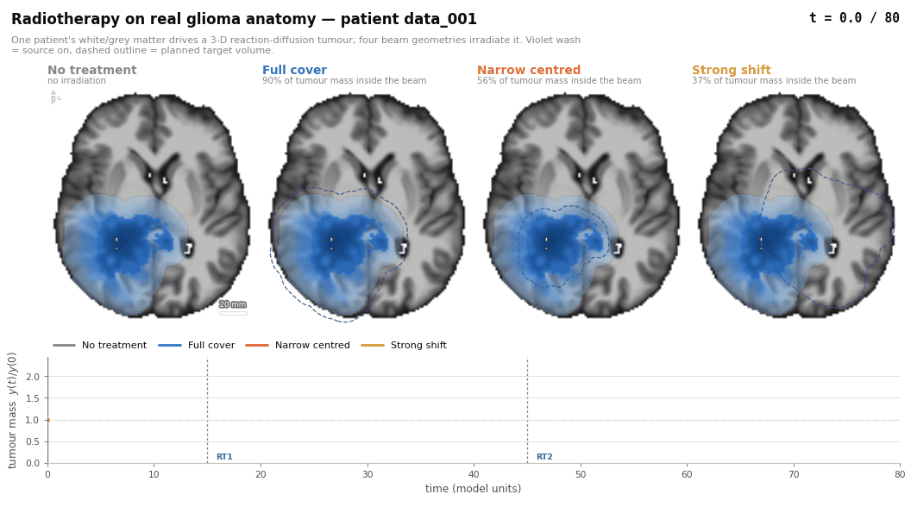
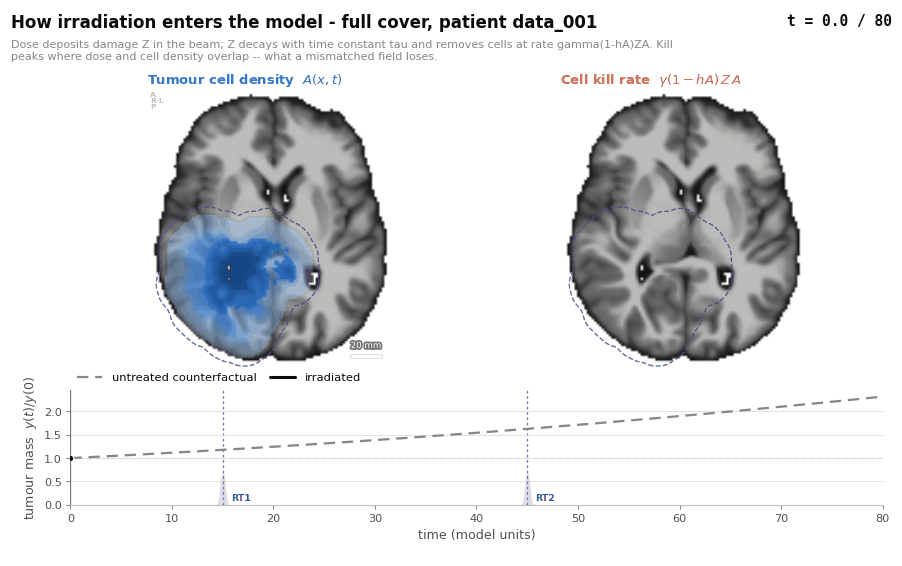
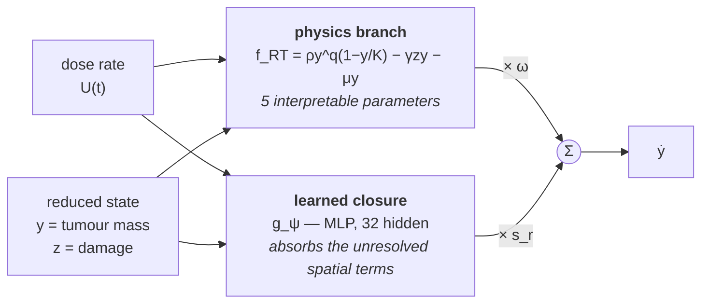
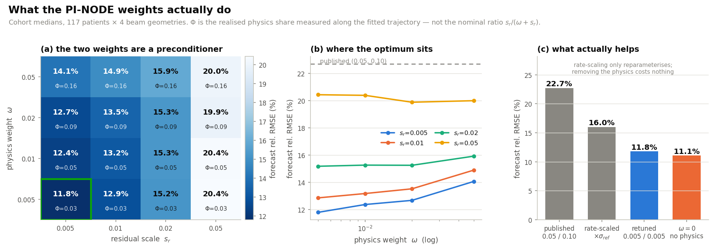
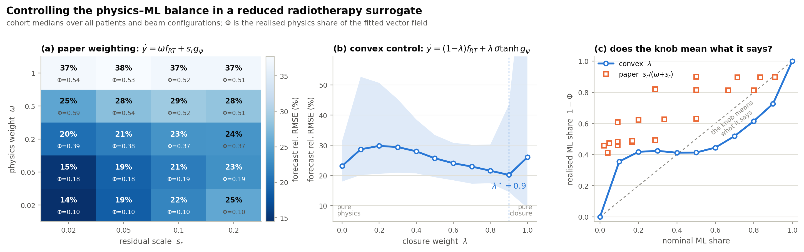
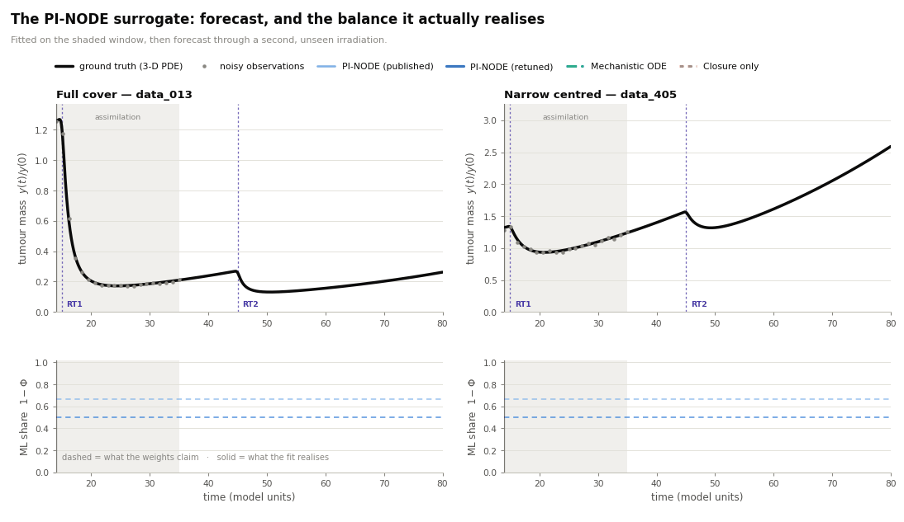
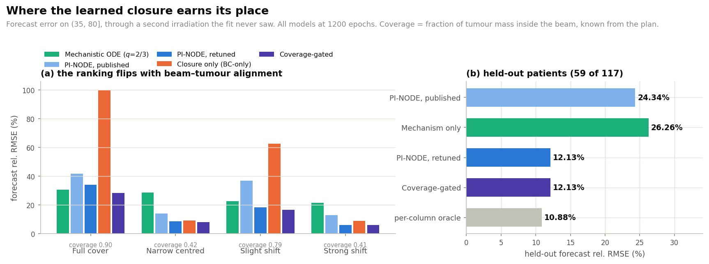

# PI-NODE for radiotherapy tumour dynamics

**What was added to GliODIL, how the surrogate is trained, what the weights
actually mean, and whether the method is worth continuing.**

Ground truth: 117 real glioma patients, each patient's own anatomy and tumour
segmentation, irradiated by four beam geometries.
All numbers below are measured on that cohort, not on a phantom.

---

## 0. Verdict first

| Question | Answer |
|---|---|
| Does a learned closure beat pure mechanism? | **Where it should, decisively.** 3.5× lower error where the beam and tumour do not line up (8.1 % vs 28.5 %); slightly *worse* where the beam already covers the tumour (32.9 % vs 30.6 %). That split is the main finding. |
| Do the two weights ω and s_r control the physics/ML balance? | **No.** They are *gauge freedoms*, verified to machine precision. They cannot be normalised to sum to one because both branches are cones. |
| So what do they do? | They **precondition the fit**, and only `s_r` matters. Since they provably cannot change what the model can express, the only channel left is the optimiser: they set the scale at which each branch's parameters are initialised and stepped. Retuning them moves accuracy 30 % without changing the model class at all. |
| Is there a simple extension that helps? | **Yes, one** — retuning the pair from (0.05, 0.10) to (0.005, 0.005) cuts forecast error from **22.7 % to 11.8 %**. Three other candidate extensions were tested and did not survive. §6. |
| What does the reduction buy? | 2.3 s on a GPU → **6.4 ms on one CPU core** (~350×), for a 2-number state. |
| Worth continuing? | **Yes**, with one change of framing — see Section 7. |

---

## 1. Ground truth: GliODIL plus radiation

### 1.1 What GliODIL gives us

For each patient: skull-stripped white-/grey-matter maps and the BraTS tumour
segmentation (enhancing core, oedema, necrosis). From the segmentation we
reconstruct a continuous initial cell density `A_0(x)` by the two-threshold
convention (`u ≥ th_up` inside the enhancing core, `u ≥ th_lo` at the FLAIR
margin), and we measure the rim thickness between the two boundaries. That rim
is the invasiveness length `L = sqrt(D_w/f)`, so the *shape* of each patient's
growth kernel is imaging-derived: an infiltrative tumour gets a
diffusion-dominated kernel, a nodular one a proliferation-dominated kernel.

**One honest caveat.** The front *speed* `v = 2 sqrt(D_w f)` cannot be
identified from a single timepoint, so it is drawn deterministically per
patient from a fixed range. Anatomy, tumour shape and invasiveness are real;
the growth rate and the radiosensitivity parameters are synthetic. This is a
study of *model behaviour on realistic geometry*, not a validated clinical
prediction.

The unmodified GliODIL forward model is Fisher–Kolmogorov on that anatomy:

```
∂A/∂t = ∇·( D(x) ∇A ) + f · A(1 − A)
D(x)  = D_w  in white matter,   D_w / r  in grey matter    (r ≈ 17)
```

### 1.2 What we added — the radiation terms

Radiotherapy is grafted on as **one new field and two new terms**. A latent
damage field `Z(x,t)` accumulates dose and repairs exponentially; damage
removes cells in proportion to how many are there to remove:

```
∂Z/∂t = − Z/τ  +  U(t) · B(x)                     ← new field (repairable damage)

∂A/∂t = ∇·(D∇A) + f A(1−A)  −  γ (1 − h A) Z A    ← new kill term
                                 └──────┬───────┘
                                  hypoxic radioresistance
```

| new symbol | meaning | value |
|---|---|---|
| `B(x)` | relative dose field, 0–1. Sigmoid-smoothed indicator of the target mask expanded by the clinical margin; the sigmoid edge is the **penumbra** (4 mm) | geometry, §1.3 |
| `U(t)` | temporal dose rate — a smooth trapezoidal pulse train | 2 fractions at t = 15, 45; amplitude 1.2, duration 0.6 |
| `γ` | radiosensitivity | per patient, randomised |
| `τ` | damage relaxation (repair) time | 3.0 |
| `h` | hypoxic radioresistance: dense regions resist dose, so `(1 − hA)` suppresses kill in the hypoxic core | per patient, randomised |

Growth is calibrated per patient by the Fisher–Kolmogorov time-rescaling
invariance — `A(x, ct)` solves the system for `(cD, cf)` — so one reference
simulation fixes every patient's growth speed against their own tumour size.

### 1.3 Four beam geometries

Two of them (`narrow_centered` and `strong_shift`) are tuned to deliver almost
the **same total dose** to the tumour through completely different spatial
patterns. A reduced 0-D surrogate sees a near-identical `U(t)` for both, so any
difference in outcome is *by construction* unresolvable without a closure term.
That is the whole experiment in one sentence.

| configuration | target mask | margin | displacement | median coverage |
|---|---|---|---|---|
| `full_cover` | FLAIR abnormality | 15 mm | — | 0.90 |
| `narrow_centered` | enhancing core | 5 mm | — | 0.42 |
| `slight_shift` | FLAIR abnormality | 15 mm | 0.75 R | 0.79 |
| `strong_shift` | FLAIR abnormality | 15 mm | 1.50 R | 0.41 |

*Coverage = fraction of tumour mass inside the beam at t = 0. `full_cover` is a
clinically standard GBM plan; the other three are controlled mismatches.
Note `narrow_centered` and `strong_shift` land at nearly the same coverage
through opposite geometric failures — too small versus displaced.*



*Violet flash = source on. Dashed outline = planned target volume. Watch t = 15:
`full cover` wraps the tumour, `narrow centred` sits inside it, `strong shift`
lands mostly on healthy tissue — and the mass curves below separate accordingly.*

The mechanism, one patient, one field:



*Left: cell density. Right: the kill rate `γ(1−hA)ZA` — cells only die where
dose **and** density overlap. That product is what a displaced field destroys.*

---

## 2. The PI-NODE surrogate

### 2.1 The reduction, and what it destroys

Integrating the PDE over the domain gives an exact but unclosed equation for the
total mass `y(t) = ∫A dx`. Three terms fail to close:

```
∫ u² dx        ≠  α y²            spatial non-linearity
∫ R(x,t)H u dx ≠  R̄_eff(t) y      inconsistent response to radiotherapy   ← the big one
∫ ξ(u,x,t) dx  ≠  0               missing physics/biology
```

The second is the killer: a 0-D state cannot represent *where* the dose landed.

**Why accept that loss at all.** One 3-D forward run costs **2.3 s on a GPU**
(160³ grid, 800 steps × 3 substeps, 5.3 M state numbers). The reduced surrogate
is **6.4 ms on one CPU core** — a **~350× speed-up**, on hardware a clinic
already has, with a 2-number state. That is the difference between a plan you
can explore interactively and one you submit as a batch job. The whole question
is how much accuracy that trade costs, and whether a learned closure can buy
some of it back.

### 2.2 The model

PI-NODE keeps a two-state mechanistic core and adds a learned residual:

```
ẏ = ω · f_RT(y, z, U; θ)  +  s_r · g_ψ(y, z, t, U)
ż = −z/τ + U(t)

f_RT = ρ · y^q · (1 − y/K)  −  γ z y  −  μ y
```

`g_ψ` is a small MLP (32 hidden units) that sees `(y, z, t, U)`.



The two weights sit on the two arrows into the sum — which is precisely why it
is tempting, and wrong, to read them as a mixture. §3 is about that.

| parameter | meaning | fitted? |
|---|---|---|
| `ρ` | intrinsic proliferation rate | learned per column |
| `K` | carrying capacity | learned |
| `γ` | radiosensitivity of the reduced state | learned |
| `μ` | net clearance/loss rate | learned |
| `τ` | damage relaxation time | learned |
| `q` | growth exponent: **2/3** (volumetric) or 1 (logistic) | fixed by choice |
| `ψ` | closure network weights | learned |
| `ω`, `s_r` | the two weights — **see §3** | fixed by hand |

The `q = 2/3` exponent is not arbitrary: a constant-speed Fisher front gives
mass ~ (a+bt)³, hence `ẏ ∝ y^(2/3)`, not the logistic `ẏ ∝ y`.

---

## 3. What ω and s_r actually mean

This is the question the project set out to answer, so it gets the most space.

### 3.1 They are not mixing weights — they are gauge freedoms

`f_RT` is **homogeneous of degree one** in `(ρ, γ, μ)` at fixed `K` (note `K`
enters only through `ρ/K`, so it must not be rescaled). Therefore

```
ω · f_RT(y,z,U; ρ, γ, K, μ, τ)  =  (ω/c) · f_RT(y,z,U; cρ, cγ, K, cμ, τ)
```

for **any** `c > 0`. Whatever you set ω to, the optimiser can undo it exactly by
rescaling θ. The same holds for `s_r`: the closure ends in an affine layer, so
`s_r` is absorbed into its output weights.

Verified numerically in float64 — trajectories under `(ω, θ)` and
`(ω/c, cθ)` agree to **0.0** and the `s_r` equivalent to **2.1 × 10⁻¹⁶**.

**This is exactly why the two numbers cannot be made to sum to one.** Both
reachable sets are *cones*: scaling a branch does not shrink what it can
express. A convex combination requires bounded sets, and neither branch is
bounded. Linear interpolation between them is therefore not merely
inconvenient — it is undefined.

### 3.2 So measure the balance instead of declaring it

Since the weights cannot be read as a mixture, we measure the mixture that the
fitted model actually produces, along its own trajectory:

```
Φ(t) = |ẏ_phys| / ( |ẏ_phys| + |ẏ_ML| )        realised physics share
```

Φ puts any parameterisation on one axis and can be compared with what the
weights claim, `s_r/(ω + s_r)`.

### 3.3 The measured landscape



Three things fall straight out of panel (a). All numbers are at one training
budget (1200 epochs), so they are directly comparable.

1. **Moving `s_r` by 10× does not move the balance at all.** Along the
   `ω = 0.005` row, Φ sits at 0.03, 0.03, 0.03, 0.03 — while the forecast error
   goes from **11.8 % to 20.4 %**. The knob that is supposed to set the balance
   does not touch it; it sets the *accuracy*, through the optimisation.
2. **Φ is exactly proportional to ω.** Down the grid: 0.03, 0.05, 0.09, 0.16 for
   ω = 0.005, 0.01, 0.02, 0.05. The physics contribution scales with its weight
   and the optimiser never pushes back — which is precisely what a gauge does
   and a mixing weight does not.
3. **The published pair is the worst cell measured.** `(0.05, 0.10)` scores
   **22.7 %**; the best cell scores **11.8 %**. And it realises **83 % ML**
   (Φ = 0.17) — so a setting described as weighting the physics at 0.05 is, in
   practice, running mostly on the neural term.

Panel (b) shows the shape of it: every `s_r` curve is nearly flat in ω, and the
curves are stacked far apart. Only one of the two weights is doing anything.

**In one sentence: PI-NODE performs best as a tightly-scaled neural closure with
a vestigial physics term — and the weights were never telling you the balance.**

### 3.4 If you want a knob that *is* a mixture



*Panel (b) is the convex control's error curve; panel (c) is the calibration
test — orange squares are the paper's parameterisation, and they sit nowhere
near the diagonal.*

A convex form works, but only if you fix all three cone problems at once:

```
ẏ = (1−λ)·f_RT  +  λ·σ_ref·tanh(g_ψ)
```

- `tanh` **bounds** the closure → turns its cone into a ball;
- a log-prior `‖log(θ/θ_ref)‖²` **anchors** the physics → stops `(1−λ)` being
  reabsorbed into θ, so λ = 0 really is the assimilated physics;
- an **orthogonality** penalty projects the closure off `span(∂f/∂θ)` → stops it
  doing anything a parameter change could have done.

Result: λ = 0 reproduces the assimilated physics bit-for-bit (error 1.6 × 10⁻¹⁶),
λ = 1 the pure closure, calibration error drops **0.294 → 0.124**, Spearman
correlation with the realised share **+0.94**, and the control spans the full
0→1 range where (ω, s_r) only reaches 0.41–0.90.

**The cost is real and worth stating:** the `tanh` bound costs about 7
percentage points of accuracy. The anchor and orthogonality terms are free —
they *help* slightly (24.2 % → 23.5 %). So there is a genuine trade:
interpretable control, or best raw accuracy. Not both, with this closure.

---

## 4. How the model is trained and fitted

Everything is fitted **per (patient, beam configuration) column** — there is no
shared network across patients. The design deliberately isolates the model from
the fitting machinery: all variants share one integrator, one optimiser, one
budget, one restart count.

| | |
|---|---|
| **Observations** | 20 evenly spaced samples of `y(t)` on `t ∈ [14, 35]` — a window that brackets the whole first fraction |
| **Noise** | `N(0, (0.02 y_i)²)`, 20 independent realisations per column |
| **Forecast window** | `(35, 80]` — contains the **second, unseen** irradiation event |
| **Scale** | 117 patients × 4 configurations = 468 columns; × 20 noise realisations = **9 360 independently fitted models per method** |
| **Integrator** | batched RK4 on a fixed refined grid, decoupled from the observation times (so a fitted parameter cannot depend on sampling density) |
| **Optimiser** | Adam, lr 1.5 × 10⁻², cosine-annealed to 5 %, 1 200 epochs, 3 random restarts, best restart by training MSE |
| **Loss** | MSE on the window + `1e-6` L2 on the closure (+ anchor/orthogonality terms where used) |

**Why it is fast.** An unrolled RK4 loop over a two-state system is
*kernel-launch bound*, not compute bound, so batch width is nearly free —
widening the batch 22× costs 1.4× wall-clock. Every method is therefore fitted
for the whole cohort in **one tensor** whose batch axis carries
`patient × configuration × noise realisation × restart`, i.e. ~10⁴ independent
reduced models trained simultaneously. Gradient clipping is per-batch-member
(a global clip would couple otherwise independent models).



*Two example patients, fitted on the shaded window and forecast through a
second irradiation they never saw. Note the failure modes: after RT2 the
mechanistic ODE (green) collapses toward zero on the left and flattens far
below the true regrowth on the right — the closure is what keeps the forecast
on the curve.*

*The lower row is the point of §3. The dashed lines are what the weights claim
(`s_r/(ω+s_r)` = 0.50 and 0.67); the solid lines are what the fit realises —
pinned near **1.0**, i.e. essentially all ML. The narrow downward spikes are not
regime changes: they are instants where the closure's derivative crosses zero,
which sends the ratio momentarily to the physics branch.*

*These are individual trajectories chosen for illustration, not evidence — they
come from an 8-patient subset where the sampling noise is far larger than the
effects in §5. The cohort statistics are the table above.*

---

## 5. Accuracy

Forecast relative RMSE on `(35, 80]`, cohort medians, **all at one training
budget (1200 epochs)** so every row is directly comparable. Lower is better.

| model | median | IQR | full cover | narrow centred | slight shift | strong shift | Φ |
|---|---|---|---|---|---|---|---|
| | | | *cover 0.90* | *cover 0.42* | *cover 0.79* | *cover 0.41* | |
| Mechanistic ODE (`q`=2/3) | 24.70 | 13.2 | **30.6** | 28.5 | 22.6 | 21.6 | 1.00 |
| Mechanistic ODE (logistic) | 27.07 | 15.8 | 38.7 | 28.4 | 30.6 | 21.0 | 1.00 |
| PI-NODE, published (0.05, 0.10) | 22.72 | 26.8 | 41.7 | 14.1 | 36.9 | 12.8 | 0.17 |
| **PI-NODE, retuned (0.005, 0.005)** | 11.80 | 16.7 | 33.9 | 8.7 | 18.2 | 6.0 | 0.03 |
| **Closure, tightly scaled (ω = 0)** | **11.08** | 17.6 | 32.9 | **8.1** | **16.6** | **5.9** | 0.00 |
| BC-only (bounded, full authority) | 26.14 | **90.9** | **100.0** | 9.3 | 62.7 | 8.8 | 0.00 |
| Pure Neural ODE | 27.98 | 19.3 | 45.1 | 29.7 | 32.4 | 21.8 | 0.00 |

**Read this table by column, not by row.** Four things:

1. **Where the field is mismatched** (narrow, strong shift — coverage ~0.4), a
   learned closure is worth **3.5×**: 8.1 vs 28.5, and 5.9 vs 21.6. This is the
   paper's central claim, and on real anatomy it is *larger* than claimed.
2. **Where the field is aligned** (`full_cover`, coverage 0.90) the plain
   mechanism still wins: **30.6 vs 32.9**. Every learned model loses there.
3. **Closure authority is the whole game, and it is not the same as
   boundedness.** `BC-only` and the ω = 0 closure are both "pure ML" with no
   mechanistic branch. `BC-only` bounds its closure but gives it full authority:
   IQR **90.9**, and 100 % error on `full_cover`. The ω = 0 closure is
   *unbounded* but tightly scaled: IQR 17.6, best model in the study. The safe
   ingredient is the small `s_r`, not the `tanh`.
4. **The pure Neural ODE is the worst model tested** (27.98) — same "all ML"
   idea again, but with neither bound nor scale control. The three all-ML rows
   span 11.1 % to 28.0 % purely on how much authority the closure is given.



---

## 6. A simple extension that helps

### 6.1 Retune the weights — the big one, and nearly free

Because ω and s_r are gauges, retuning them **cannot** change what the model can
express. It changes only the optimisation path — which turns out to matter
enormously. Moving `(0.05, 0.10) → (0.005, 0.005)`, same run, same budget:

| | published | retuned | change |
|---|---|---|---|
| forecast rel-RMSE, whole cohort | 22.72 % | **11.80 %** | **−48 % relative** |
| held-out half of the patients | 24.34 % | **12.13 %** | **−50 % relative** |

No new terms, no new parameters, one line of config. For scale: switching the
growth exponent — logistic vs volumetric vs trainable — moves the same metric by
**0.1 points** (15.27 / 15.26 / 15.16). The weights are worth ~100× more than
the growth law, and only one of them (`s_r`) is doing the work.

### 6.2 Choosing the branch from the plan: tested, and it does not survive

§5 shows the mechanism winning on `full_cover` and losing badly elsewhere, and
coverage is known from the plan for free. So: use the mechanism above a coverage
threshold, the closure below it. Threshold fitted on 58 patients, evaluated on
the other 59, everything at 1200 epochs.

| model | held-out rel-RMSE |
|---|---|
| PI-NODE, published | 24.34 % |
| Mechanism only | 26.26 % |
| Best closure | **12.13 %** |
| Coverage-gated (mech above 0.90) | **12.13 %** |
| *per-column oracle (upper bound)* | *10.88 %* |

**It buys nothing.** Zero on held-out patients, 0.17 points on the full cohort.

I am reporting this as a negative because an earlier version of the same
experiment — run against a weaker, 900-epoch closure — showed a 0.72-point gain,
and that gain evaporated once the closure was properly scaled. The gate was
compensating for a badly-tuned closure, not adding information.

Two things survive the negative and are worth keeping:

- **Within `full_cover` the structure is real**: gated scores 28.32 against 30.57
  for the mechanism and 32.91 for the closure — it beats *both*. It just does not
  move a cohort median in which that subgroup is one case in four.
- **The headroom is small anyway.** The per-column oracle over these two models
  is 10.88 % against 12.13 %. There are only ~1.25 points on the table for *any*
  selection rule, perfect ones included.

### 6.3 What did not work: per-patient rate scaling

If the weights set each branch's scale, then a *single global* pair must be
wrong for a heterogeneous cohort — σ_ref (each patient's own rate scale) spans
3.1× from p10 to p90. So I made both weights multiples of σ_ref instead of
absolute numbers.

**It makes no difference.** The best rate-scaled cell is 16.00 %; its matched
fixed cell — same *effective* scale, since median σ_ref = 0.0795 — is 15.93 %.
Identical to within the resolution of the sweep.

That null is not a disappointment, it is a confirmation: a gauge times a
per-patient constant is still a gauge. Nothing in §3.1 predicted otherwise, and
the experiment says so.

### 6.4 The uncomfortable control: what if ω = 0?

Since Φ falls to 0.03 at the winning cell, the obvious question is whether the
mechanistic branch is doing anything at all. So: run it with `ω = 0` exactly.

| s_r | ω = 0.005 | **ω = 0** | physics worth |
|---|---|---|---|
| 0.005 | 11.80 % | **11.08 %** | **−0.72 pts** (it *hurts*) |
| 0.02 | 15.19 % | 15.22 % | −0.03 pts (nothing) |
| 0.05 | 20.44 % | 22.50 % | +2.06 pts (it helps) |

Read that bottom-to-top. **When the closure has a lot of authority, the physics
anchors it and is clearly worth having. When the closure is tightly scaled, the
physics is worth nothing — and at the accuracy optimum it is very slightly
harmful.** The best single model in this entire study is a *pure* learned
closure with a small output scale, at **11.08 %**.

This is the one result that cuts against the premise, so it should not be
buried. Two things stop it from being fatal:

- **It is a median.** Per beam geometry, `ω = 0` scores 32.9 / 8.1 / 16.6 / 5.9
  — still *losing on `full_cover`* to the plain mechanism. The physics is not
  useless; it is useless *on average*, because a fixed weight applies it in the
  regime where it hurts as well as the one where it helps.
- **Scale control, not boundedness, is what makes a closure safe.** `BC-only`
  (bounded closure, full authority) has an IQR of 90.9 and is 100 % wrong on
  `full_cover`. The tiny-`s_r` unbounded closure has an IQR of 17.6. Same
  "pure ML" idea, completely different risk profile.

---

## 7. Is this worth continuing?

**Yes — but not as a fixed blend. As a conditional one.**

### What is solid

1. **The reduction is worth doing.** 2.3 s on a GPU → 6.4 ms on a CPU core, for
   a 2-number state.
2. **A learned closure recovers most of what the reduction destroys.** Where the
   beam and tumour do not line up, forecast error drops from 28.5 % to 8.1 %.
   That is the paper's central claim, confirmed on real anatomy.
3. **The weights are gauges, and the study now proves it three ways**:
   analytically, numerically (2.1 × 10⁻¹⁶), and empirically — Φ scales linearly
   with ω across the whole grid (0.03, 0.05, 0.09, 0.16 for ω = 0.005 … 0.05).
4. **Retuning is nearly free and worth 48 %** (22.7 % → 11.8 %), and it matters
   ~100× more than the growth-law choice the paper spends effort on: at
   (0.02, 0.02), logistic / volumetric / trainable-`q` give 15.27 / 15.26 /
   15.16 — a 0.1-point spread against the weights' 11-point spread.

### What has to change

5. **Stop calling `ω` and `s_r` a physics/ML balance.** They are gauges. Report
   the realised Φ instead. Published (0.05, 0.10) realises 83 % ML.
6. **`s_r` is the only weight that matters, and what it really controls is
   closure authority.** Across the grid, `s_r` moves the error 8.6 points and
   `ω` moves it 2.1. Small `s_r` suppresses neural-ODE drift in the forecast
   window — which is why the pure NODE, with no such control, is the *worst*
   model in the study at 28.0 %.
7. **A fixed blend weight is the wrong object.** §6.4 is blunt about this: at
   the accuracy optimum, deleting the mechanistic branch entirely *improves*
   the median. Not because the physics is wrong, but because a constant weight
   forces it into the regime where it hurts (`narrow`, `strong shift`) as well
   as the one where it helps (`full_cover`, where it still wins outright).

### Where the next gain is — and it is not in selection

The per-column oracle over the mechanism and the best closure is **10.88 %**
against **12.13 %** for the closure alone. That is the *entire* budget available
to any rule that picks between these two models, and a coverage threshold
captured none of it on held-out patients (§6.2). Selection is a dead end.

The live target is the case where **every** model is bad. On `full_cover` — the
easy, well-aligned case — the mechanism gets 30.6 % and the best closure 32.9 %.
Nothing tried here goes below 28 %. That is not a blending problem or a tuning
problem; it is the two-state reduction failing on a case with no geometric
mismatch at all.

**Three concrete steps, in order of expected value:**

1. **Enrich the reduced state.** Carry one spatial moment — tumour radius, or
   the mass-weighted dose coverage — as a third ODE state. The closure is
   currently being asked to reconstruct a spatial quantity from two scalars;
   giving it a third is far cheaper than making it bigger, and it attacks the
   `full_cover` failure that neither branch currently touches.
2. **Condition the closure on plan coverage** — as an *input*, not as a gate.
   Gating failed (§6.2), but within `full_cover` the gated model still beat both
   of its parents (28.32 vs 30.57 and 32.91), so the signal is real even though
   a hard threshold cannot cash it in.
3. **Fix the budget before comparing anything.** 900 vs 1200 epochs moves the
   published PI-NODE by 1.9 points, in the *wrong* direction, and it silently
   inverted one of the conclusions in this very study.

### What not to spend time on

- **Learning the gate from the reduced state.** Refuted twice: a freer gate is
  worse (η = 0 → 29.0 %), and handing it the exact regime signal changes nothing
  (28.42 vs 28.45). Observability limit, not a tuning problem.
- **Per-patient rate normalisation of the weights** (§6.3). A gauge times a
  per-patient constant is still a gauge: 16.00 % against its matched fixed cell
  at 15.93 %.
- **Tuning the growth exponent.** 0.1 points. The weights are 11.

### The honest one-line answer

*Physics + learned closure is the right architecture, but the physics earns its
place by being switched in where the reduction is valid — not by being blended
in everywhere with a constant weight.*

---

## Reproducing

```bash
PYTHONPATH=src python experiments/gen_cohort.py          # 3-D ground truth (GPU)
PYTHONPATH=src python experiments/bench.py --group pinode --gpus 4,5,6,7
PYTHONPATH=src python experiments/aggregate_bench.py --group pinode
PYTHONPATH=src python experiments/coverage_gate.py       # §6.2
PYTHONPATH=src python experiments/make_animations.py     # the GIFs
PYTHONPATH=src python experiments/make_presentation.py   # the figures
```

Model definitions: `src/cancer_sim/gpu/surrogates.py`.
Radiation terms added to GliODIL: `src/cancer_sim/realdata/fk_rt_gpu.py`,
beam geometry in `src/cancer_sim/realdata/patient.py`.
