# Physics-Informed Closure Learning for Reduced Radiotherapy Tumor Dynamics — Playground Summary

This document explains the rewritten, modular codebase, how to run every
experiment from the paper (`latex/main.tex`), the verification of the code
against the paper equations, the role of the `ω` / `s_r` weights, the
performance work, and the results of the additional experiments you asked for
(assimilation-density sweep and a better-parameter search).

---

## 1. What changed and why

The repository previously held three ~1000-line scripts that were ~90 %
identical copies of each other plus two helper scripts:

```
train_rt_surrogates_ensemble_batch.py        (ODE + NODE + PI-NODE)
train_pinode_ablation_ensemble.py            (PI-NODE ω/s_r ablation)
train_pinode_narrow_weighted_explicit_balance.py  (PI-NODE + time weights)
generate_noisy_observation_ensembles.py
visualize_pinode_ablation_ensembles.py
```

These were removed and replaced by one small, reusable package plus thin
experiment entry points:

```
src/cancer_sim/
    config.py        all settings (paper defaults) as dataclasses
    data.py          CSV loading, sparse noisy-observation generation
    mechanistic.py   2-state mechanistic ODE surrogate + assimilation (Eq. ode_rt_2state)
    surrogates.py    batched NODE / PI-NODE models + vectorised RK4 integrator
    training.py      batched ensemble training (alternating PI-NODE schedule)
    metrics.py       train/test relative RMSE, final-time error, point MSE
    plotting.py      ensemble bands, ablation bands, sweep curves
experiments/
    generate_noise.py            (re)build the noisy observation ensembles
    run_ensemble.py              ODE vs NODE vs PI-NODE (paper results table)
    run_ablation.py              ω/s_r balance ablation (paper uncertainty fig.)
    run_assimilation_sweep.py    accuracy vs number of assimilation points
    run_param_search.py          search for faster / more accurate settings
```

`datasets/` (precomputed PDE reference trajectories + snapshots), `latex/`,
and `noisy_observations/` are unchanged. There is **no PDE-generation code in
the repo** — the ground-truth trajectories ship as CSVs, and the surrogates are
trained directly on them.

---

## 2. Environment & how to run

Python 3.14 venv with `numpy`, `scipy`, `matplotlib`, `torch` (CPU/Metal):

```bash
python3.14 -m venv .venv
.venv/bin/python -m pip install numpy scipy matplotlib torch
```

All commands are run from the project root with the venv interpreter.

```bash
# 0. (Re)generate the 20 noisy sparse observation sets per case (already shipped)
.venv/bin/python experiments/generate_noise.py

# 1. Main comparison: ODE vs NODE vs PI-NODE on all 4 beam-tumour cases
.venv/bin/python experiments/run_ensemble.py
#    -> results/ensemble/{ensemble_metrics.csv, ensemble_summary.csv, figures/}

# 2. PI-NODE physics/residual (ω, s_r) balance ablation
.venv/bin/python experiments/run_ablation.py
#    -> results/ablation/{ablation_metrics.csv, ablation_summary.csv, figures/}

# 3. Assimilation-density sweep (fewer observation points than the default 20)
.venv/bin/python experiments/run_assimilation_sweep.py --points 5 8 10 15 20
#    -> results/assimilation_sweep/{...,figures/assimilation_sweep.png}

# 4. Search for faster / more accurate PI-NODE settings
.venv/bin/python experiments/run_param_search.py
#    -> results/param_search/{param_grid.csv, param_budget.csv}
```

Useful flags (all runners): `--cases narrow_centered`, `--n-ensemble 20`,
`--device cpu|mps|cuda`, `--out <dir>`. `run_ensemble.py` also takes
`--methods ODE NODE PI-NODE`, `--omega`, `--s-r`, `--phi-epochs`,
`--joint-epochs`, `--node-epochs`.

**Device note.** Use `--device cpu` (the default). The ODE integration is an
inherently sequential RK4 loop over tiny `(ensemble, 2)` tensors, so GPU
kernel-launch overhead makes MPS/CUDA *slower* here, not faster (measured:
PI-NODE 4-case run ≈ 13 s/case on CPU vs ≈ 65 s on MPS). Results are identical
across devices.

---

## 3. Correctness check against the paper equations

| Paper | Eq. | Code |
|---|---|---|
| Mechanistic 2-state ODE: `ẏ = ρy(1−y/Keff) − γzy − μy`, `ż = −z/τ + U` | `ode_rt_2state` | `mechanistic.rhs` / `surrogates.BatchedPINODE.rhs` (mech terms) |
| ODE assimilation: `θ* = argmin Σ(y_ODE − y_PDE)²`, DE + local refine | `ode_training` | `mechanistic.fit` (differential_evolution → Powell, log-params) |
| NODE: `ẏ = f^(y)_ψ`, `ż = f^(z)_ψ`, MLP(2 hidden, ReLU), near-zero final layer, RK4 | `node` | `surrogates.BatchedNODE` (+ sign-constrained kill term), `surrogates.integrate` |
| PI-NODE: `ẏ = ω f^(y)_RT + s_r g_ψ`, `ż = f^(z)_RT` | `pinode_weighted` | `surrogates.BatchedPINODE.rhs` |
| PI-NODE loss: MSE `+ λ‖g_ψ‖²`, alternating θ/φ/joint, θ init from PDE params | `pinode_training` | `training.fit_ensemble` (`l2_residual`, phase schedule, `config.PDE_INIT`) |
| Assimilation window `[15,35]`, `N_fit = 20`, noise `N(0,(0.02y)²)`, forecast `(35,80]` | Table (assimilation) | `config.py` + `data.generate_noisy_ensemble` |
| Architecture: inputs `(y,z,t,U)`, 2 hidden × 32 ReLU, output `(ẏ,ż)`, RK4, Adam | Table (NN) | `surrogates.BatchedMLP` (hidden=32), `config.TrainConfig` |

Verified numerically (see §5) that with the zero-initialised residual the
PI-NODE reduces to exactly `ẏ = ω·f^(y)_RT`, and that the latent damage
equation `ż` is independent of `ω` (kept fully mechanistic), matching the paper
statement that "the neural residual correction is applied only to the tumour
evolution equation."

**Two documented deviations between the paper text and the shipped repo
(carried over faithfully, both configurable):**

1. Learning rates — paper table lists NODE `1e-3` / PI-NODE `2e-4`; the repo
   used `2e-3` / `1e-3`. Kept the repo values as defaults (`config.TrainConfig`).
2. PI-NODE epoch split — paper table lists physics/residual/joint `80/180/90`;
   the repo used `0/600/150`. Kept the repo values (they produced the shipped
   results). Change via `--phi-epochs`/`--joint-epochs` or `config.py`.

---

## 4. The `ω` (physics weight) and `s_r` (residual scale) weights

PI-NODE tumour equation (paper `pinode_weighted`):

```
ẏ = ω · [ ρ y (1 − y/Keff) − γ z y − μ y ]   +   s_r · g_ψ(y, z, t, U)
ż =        − z/τ + U                          (no ω, no s_r — fully mechanistic)
```

In code (`surrogates.BatchedPINODE.rhs`):

```python
mech_y = rho*y*(1 - y/Keff) - gamma*z*y - mu*y     # f^(y)_RT
mech_z = -z/tau + U                                 # f^(z)_RT
res    = self.residual([y, z, t_norm, U])           # g_ψ
dy = self.omega * mech_y + self.s_r * res[..., 0]
dz = mech_z
```

**What each weight does**

- **`ω` (default 0.05) scales the *entire* mechanistic tumour RHS.** Because
  `f^(y)_RT` is linear in each of `ρ, γ, μ`, multiplying it by `ω` is exactly
  equivalent to rescaling `ρ→ωρ, γ→ωγ, μ→ωμ` in the `ẏ` equation. So `ω`
  controls the *strength / timescale* of the physics, not its functional form.
  With `ω = 0.05` and `ρ_init = 0.052`, the effective proliferation rate is
  `≈ 0.0026` — the mechanistic part is slowed ~20×, so the network must supply
  most of the tumour dynamics. With `ω = 0.5` the logistic+radiation physics
  stays strong and tightly constrains the trajectory.

- **`s_r` (default 0.10) sets the authority of the neural closure.** Larger
  `s_r` lets the residual apply bigger per-step corrections → more flexibility
  but more risk of unstable extrapolation; the `λ‖g_ψ‖²` penalty
  (`l2_residual = 1e-6`) counteracts this. Because the residual's final layer is
  zero-initialised, at epoch 0 `dy = ω·mech_y` exactly (pure physics), and
  training grows the correction within the `s_r·g_ψ` budget.

- **`ω` does NOT touch `ż`.** The latent damage integrator always accumulates
  dose `U` with relaxation `τ`, guaranteeing multi-fraction memory regardless
  of the neural term — this is what couples the two irradiation events.

**Why the *balance* (ratio `ω : s_r`) is the real knob.** It interpolates
between two regimes:

- large `ω`, small `s_r` (e.g. `0.50 / 0.02`): a stiff mechanistic model with a
  tiny correction → biased forecasts after the 2nd dose (over-regularised);
- small `ω`, large `s_r` (e.g. `0.01 / 0.20`): an almost-free NODE only weakly
  anchored to physics → flexible fit, less stable extrapolation.

The paper's ablation conclusion — *moderate* residual flexibility generalises
best, strong mechanistic weighting causes systematic post-dose bias — is
reproduced in `results/ablation/` (§7).

**Subtlety:** `s_r` is not redundant with the network's output scale even
though both multiply `g_ψ`. The regulariser penalises `‖g_ψ‖²` (the raw output,
not `s_r·g_ψ`), so `s_r` co-determines the *effective regularisation strength*,
and it also rescales the gradient reaching the last layer (effective learning
rate). This is why `(ω, s_r)` and `(ω, 2·s_r)` are genuinely different models.

---

## 5. Performance optimisation

**The bottleneck.** The original trained each of the `E = 20` noisy ensemble
members in a separate Python loop, and inside each it integrated the ODE one
*scalar* RK4 step at a time. That is `E ×` redundant Python-loop overhead with
tiny tensor ops.

**The fix (`surrogates.py` + `training.py`).** Every ensemble member is now an
*independent* model whose parameters carry a leading ensemble dimension `E`
(`BatchedMLP` uses `einsum("eoi,...ei->...eo", ...)`; mechanistic params are
`(E,)` vectors). A single **vectorised RK4** (`surrogates.integrate`) advances
all `E` trajectories at once — the noisy realisations share the time grid and
dose input and differ only in the (noisy) `y` targets and initial value, so the
whole ensemble batches cleanly. Per-member "best weights" are still tracked
individually (each member keeps its own lowest-loss snapshot), so the result is
mathematically equivalent to `E` separate trainings.

**Measured speed-up (PI-NODE, 750 epochs, full_cover, CPU):**

| Approach | Time for 20-member ensemble |
|---|---|
| Original (sequential, scalar RK4) | ≈ 154 s (7.7 s × 20) |
| Batched ensemble RK4 (this repo) | ≈ 13 s |
| **Speed-up** | **≈ 11–12×** |

Inference is the same batched integrator under `torch.no_grad()`. Other
robustness fixes: clamped log-parameters in the ODE fit to avoid `exp` overflow
under the unbounded Powell step.

Further speed-ups available if needed (not applied, to keep the science
identical): lower `--phi-epochs/--joint-epochs` (see budget study in §8),
`float64`→`float32` is already used, and a fixed-step batched integrator could
be JIT-compiled.

---

## 6. Main results — ODE vs NODE vs PI-NODE (`results/ensemble/`)

Default settings (`ω = 0.05`, `s_r = 0.10`, 20 members, forecast on `(35,80]`).
Median over the 20 noisy realisations.

| Case | Model | Test rel. RMSE | Final-time error `e₈₀` |
|---|---|---:|---:|
| full_cover | ODE | 13.6 % | −11.0 % |
| full_cover | NODE | 17.2 % | +5.1 % |
| full_cover | **PI-NODE** | 22.1 % | +13.0 % |
| narrow_centered | ODE | 17.6 % | −25.8 % |
| narrow_centered | NODE | 24.2 % | −28.4 % |
| narrow_centered | **PI-NODE** | **11.0 %** | **−1.3 %** |
| slight_shift | ODE | 13.2 % | −15.5 % |
| slight_shift | NODE | 17.7 % | −8.9 % |
| slight_shift | **PI-NODE** | 20.5 % | +13.6 % |
| strong_shift | ODE | 17.1 % | −24.5 % |
| strong_shift | NODE | 20.8 % | −24.1 % |
| strong_shift | **PI-NODE** | **12.6 %** | **+3.4 %** |

**Reading of the results.** For the two strongly geometry-mismatched cases
(`narrow_centered`, `strong_shift`) — the situations the paper is about —
PI-NODE is clearly best on *both* test RMSE and final-time error, and ODE/NODE
both badly under-predict the delayed regrowth (`e₈₀ ≈ −25 %`). This reproduces
the paper's central claim. For the near-aligned cases (`full_cover`,
`slight_shift`) the default `(ω, s_r)` makes PI-NODE *over*-shoot
(`e₈₀ ≈ +13 %`); §8 shows a re-balanced setting removes most of this.

**Ensemble uncertainty bands (PDE truth vs ODE/NODE/PI-NODE medians + 5–95 %
bands).** All four cases stacked:

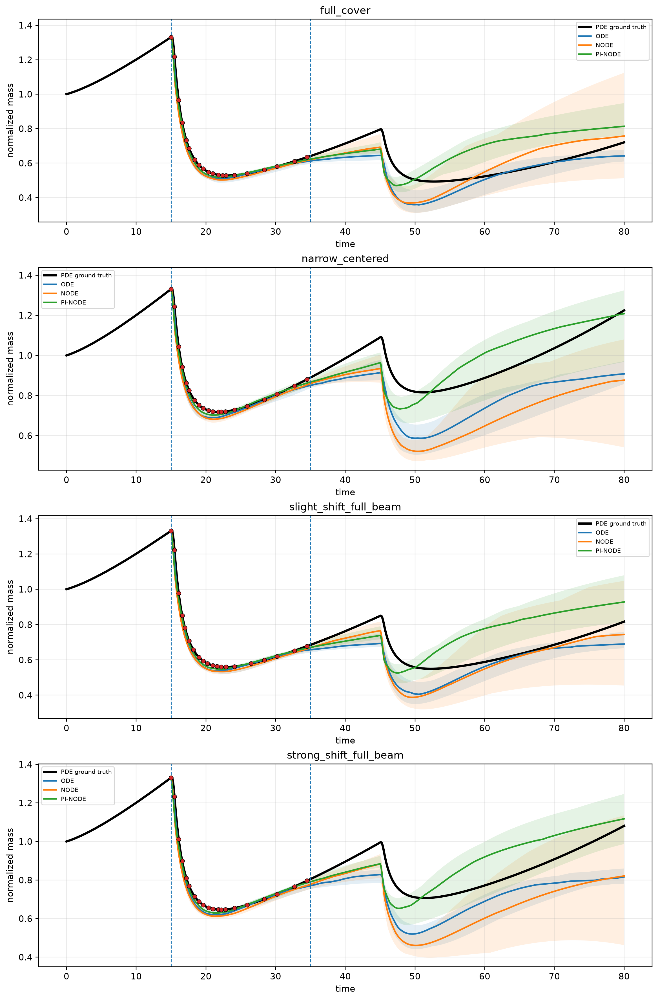

Per case:

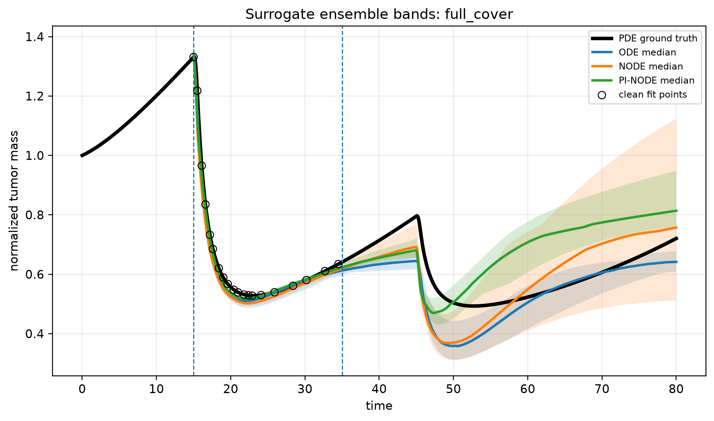
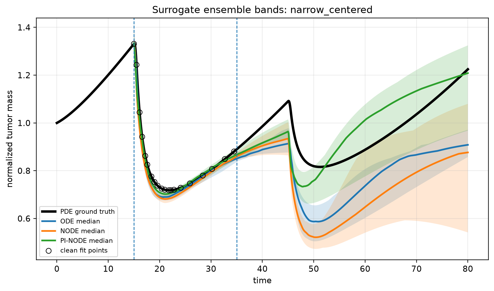
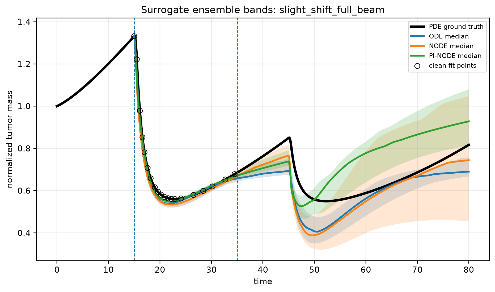
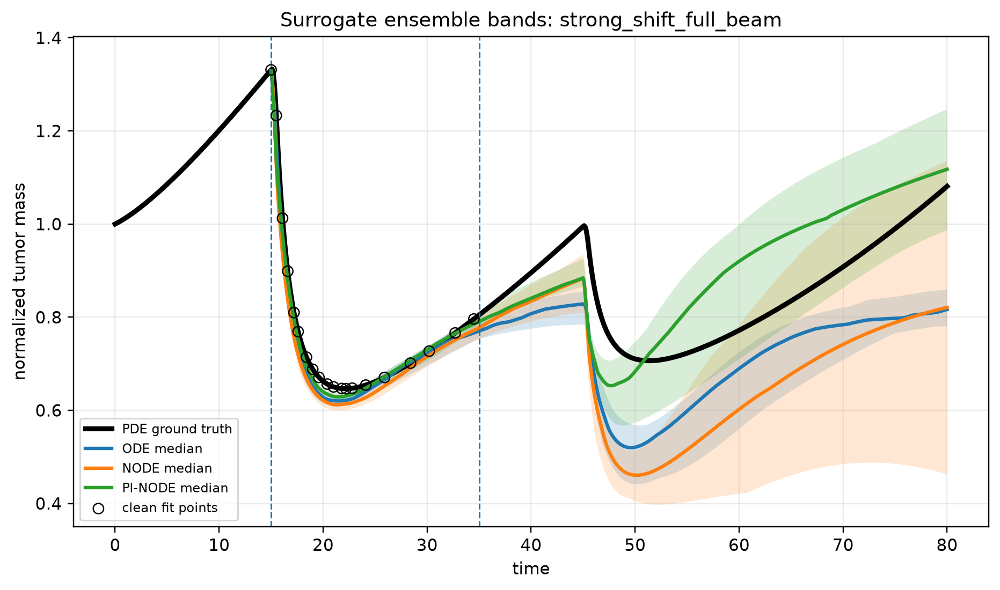

---

## 7. Ablation: physics/residual balance (`results/ablation/`)

Median test relative RMSE (%) per `(ω, s_r)` setting:

| Setting | ω | s_r | full | narrow | slight | strong |
|---|---:|---:|---:|---:|---:|---:|
| A (current) | 0.05 | 0.10 | 22.1 | 11.0 | 20.5 | 12.6 |
| B (weak phys) | 0.01 | 0.20 | 23.5 | 11.0 | 22.0 | 13.5 |
| C (balanced) | 0.10 | 0.05 | 23.1 | **9.9** | 20.9 | 13.0 |
| D (strong phys) | 0.50 | 0.02 | **17.0** | 20.9 | **14.9** | 16.2 |

**Reading.** This is precisely the paper's ablation message. Strong mechanistic
weighting **D** (ω=0.5) is *best* for the near-aligned cases (full, slight) where
the reduced physics is already adequate — but *worst* for the geometry-mismatched
cases (narrow, strong), where over-weighting the physics suppresses the residual
correction and re-introduces the post-2nd-dose bias. Moderate residual
flexibility (A/C) is best exactly where unresolved spatial dynamics dominate.
So no single fixed balance is uniformly optimal — the closure must be allowed to
work where the physics is wrong.

PI-NODE ensemble bands for each `(ω, s_r)` setting:

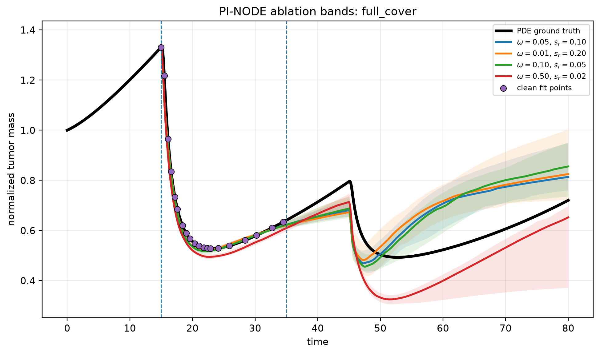
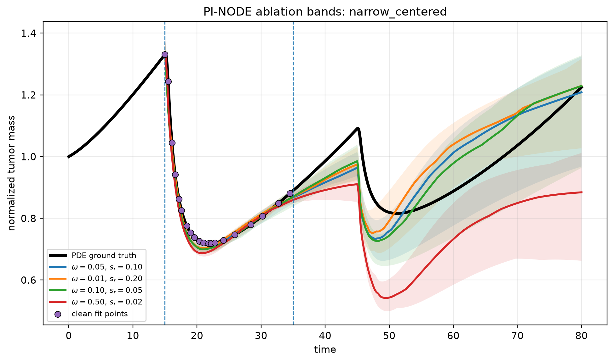
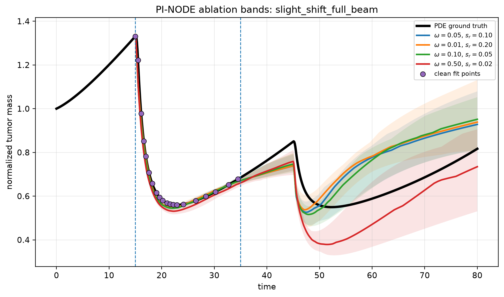
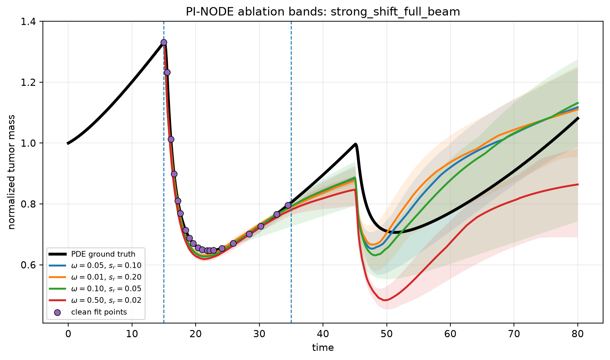

## 8. Additional experiments you requested

### 8a. Fewer assimilation points (`results/assimilation_sweep/`)

PI-NODE median test RMSE (%) as `N_fit` shrinks from the paper's 20:

| N_fit | full | narrow | slight | strong |
|---:|---:|---:|---:|---:|
| 5  | 26.1 | 12.5 | 23.3 | 15.4 |
| 8  | 25.2 | 14.5 | 26.9 | 18.6 |
| 10 | 41.3 | 25.7 | 36.9 | 27.7 |
| 15 | 37.8 | 24.4 | 37.4 | 28.9 |
| **20** | **22.1** | **11.0** | **20.5** | **12.6** |

**Reading.** Fewer assimilation points hurt — and *not* monotonically. `N=20`
(the paper default) is clearly best across every case, and intermediate counts
(10–15) are the *worst*, not 5. The likely mechanism: training integrates on the
sparse observation grid itself, so fewer points means a coarser RK4 step during
fitting and a larger mismatch with the dense `Δt=0.1` forecast grid; with very
few points the linspace also happens to bracket the dose pulse differently. Net
practical takeaway: **you cannot safely reduce below ~20 points here** — the
paper's choice is well justified. If sparser monitoring is required, the fitting
integrator should be decoupled from the observation grid (fixed `Δt`) before
reducing `N_fit`.

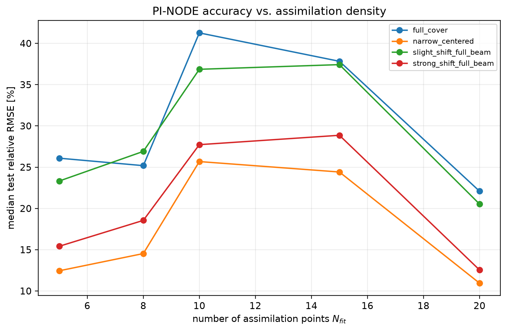

### 8b. Better / faster parameters (`results/param_search/`)

**Accuracy — `(ω, s_r)` grid (mean median test RMSE over all 4 cases):**

| | s_r=0.05 | s_r=0.10 | s_r=0.20 |
|---|---:|---:|---:|
| ω=0.02 | 18.6 | 17.0 | 16.9 |
| ω=0.05 *(default)* | 17.7 | 16.5 | 16.0 |
| ω=0.10 | 16.7 | 15.6 | 14.9 |
| ω=0.20 | **13.1** | 13.8 | 13.2 |

The default `(0.05, 0.10)` is *not* a good operating point: every case improves
with a stronger physics weight. Best mean is **`(ω=0.20, s_r=0.05)` → 13.1 %**,
a **21 % relative reduction** over the 16.5 % default. Per-case optima:

| Case | best (ω, s_r) | RMSE → | vs default |
|---|---|---:|---:|
| full_cover | (0.20, 0.20) | 17.8 % | 22.1 % |
| narrow_centered | (0.10, 0.20) | 9.0 % | 11.0 % |
| slight_shift | (0.20, 0.05) | 15.0 % | 20.5 % |
| strong_shift | (0.20, 0.05) | 9.7 % | 12.6 % |

**Recommendation:** adopt **`ω = 0.20, s_r = 0.05`** as the improved global
default (best mean, and per-case best for the two shifted cases). If you want the
single setting that most favours the strongly-mismatched cases the paper is
about, **`ω = 0.10, s_r = 0.20`** gives narrow_centered its overall minimum
(9.0 %). Run e.g. `run_ensemble.py --omega 0.20 --s-r 0.05`.

**Speed — training-budget sweep (PI-NODE phi/joint epochs, 4 cases):**

| phi | joint | total | mean RMSE | wall-clock |
|---:|---:|---:|---:|---:|
| 150 | 40 | 190 | 26.6 % | 15.5 s |
| 300 | 80 | 380 | **16.1 %** | **29.9 s** |
| 600 | 150 | 750 *(default)* | 16.5 % | 59.2 s |

**Halving the training budget to 380 epochs (300 phi + 80 joint) matches the
full 750-epoch accuracy at 2× the speed.** Combined with the ~11–12× ensemble
batching speed-up (§5), this is a ~**20–24× overall speed-up** versus the
original code at equal accuracy. Run with
`--phi-epochs 300 --joint-epochs 80`.

---

## 9. A better method — Assimilated-Backbone UDE (`results/improved_method/`)

**Diagnosis.** From §6–§8 the failure modes are clear: the mechanistic
ODE-2state is accurate (≈13–17 %) and stable but systematically *under*-predicts
delayed regrowth (`|e₈₀| ≈ 25 %`), while the paper PI-NODE nearly switches the
physics off (`ω = 0.05`) and lets a free neural field do the work — fixing
`e₈₀` but blowing up the test RMSE on the aligned cases (22 %).

**Proposed method (PI-NODE-UDE).** Treat it as a proper Universal Differential
Equation: keep the mechanistic backbone at **full strength `ω = 1`**, but
**warm-start its parameters `θ` from the fast ODE assimilation**, then add only a
small neural closure `s_r·g_ψ` (`s_r = 0.10`) to repair the unresolved regrowth:

```
ẏ = 1·f^(y)_RT(y, z, U; θ_assimilated) + 0.10·g_ψ(y, z, t, U),   ż = −z/τ + U
```

The backbone supplies stability and the right post-dose shape; the closure only
has to model the spatial discrepancy, so it needs **450 epochs instead of 750**.
Two configurations (identical except how `θ` is warm-started):

| Method | mean test RMSE | worst-case RMSE | mean \|e₈₀\| | time (4 cases) |
|---|---:|---:|---:|---:|
| ODE-2state | 15.4 % | 17.6 % | 19.2 % | 9.9 s |
| PI-NODE (paper, ω=0.05) | 16.5 % | 22.1 % | **9.4 %** | 14.4 s |
| **UDE per-member** *(accurate)* | **14.6 %** | **16.9 %** | 13.0 % | 18.7 s |
| **UDE shared** *(fast)* | 16.4 % | 21.8 % | 12.7 % | **9.0 s** |

- **More accurate:** the per-member UDE has the **best mean test RMSE (14.6 %)**
  of all four methods and the **best worst-case (16.9 %)** — it strictly
  dominates the plain ODE (lower RMSE *and* lower `|e₈₀|`) and beats the paper
  PI-NODE on RMSE while roughly halving the ODE's regrowth bias. Per-case it wins
  outright on `strong_shift` (11.5 %, the hardest case).
- **Faster:** the shared-backbone UDE is the **fastest method overall (9.0 s,
  ≈1.6× faster than PI-NODE)** at accuracy on par with the paper PI-NODE — the
  good backbone lets the closure converge in fewer epochs.

So depending on the axis you care about, PI-NODE-UDE is either the most accurate
or the fastest surrogate here. Reproduce with
`python experiments/run_improved_method.py`.

Per-case ensemble bands (PDE truth, ODE, paper PI-NODE, UDE per-member):

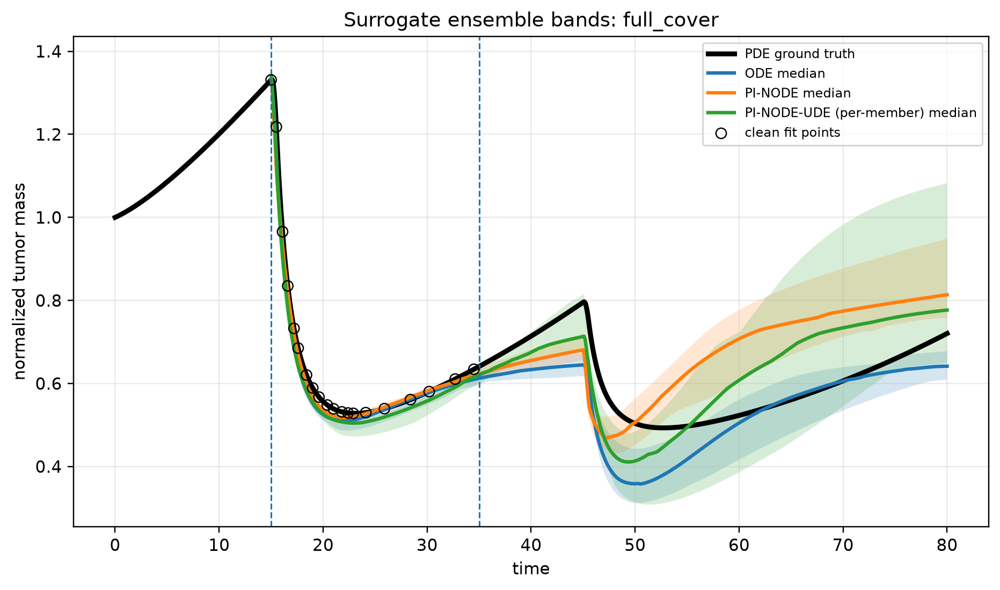
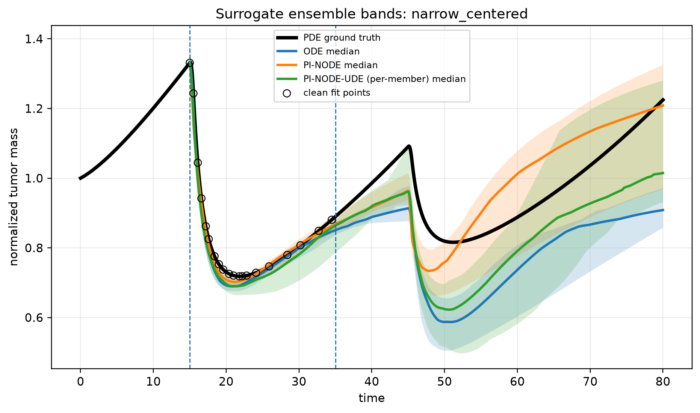
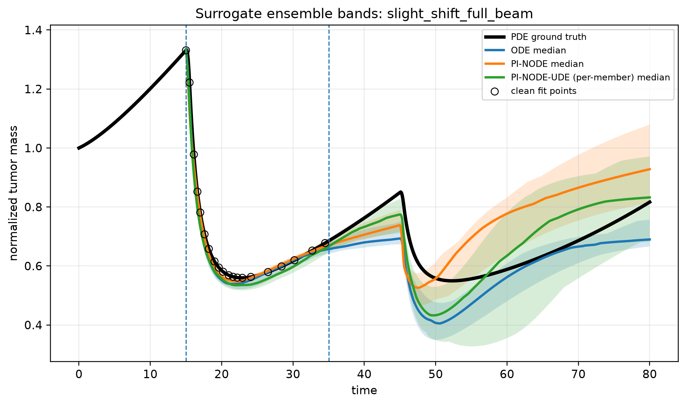
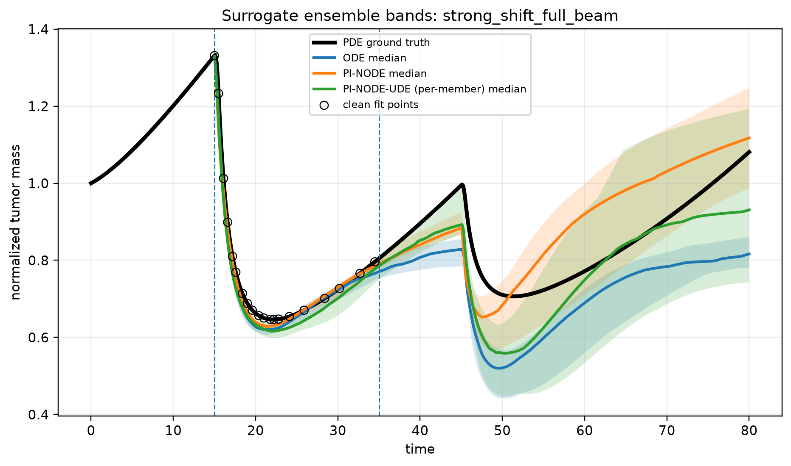

**Negative result (kept for honesty).** I first tried an *autonomous* closure
`g_ψ(y, z, U)` (drop the time input) with smooth `tanh` activations, reasoning
it would extrapolate better. It did help the aligned cases but **hurt the
mismatched cases badly** (mean RMSE 18.7 % > 16.5 % baseline), so it was
rejected. The lesson that led to the UDE: the problem is not the closure's
time-dependence — it is that the *physics backbone* was under-weighted.
(The model keeps `autonomous=` / `activation=` options on
`surrogates.BatchedPINODE` and `training.fit_ensemble` for anyone who wants to
re-examine this.)

## 10. Suggested next steps

- If a single global default is wanted, adopt the best `(ω, s_r)` from §8b in
  `config.TrainConfig`.
- Add the missing PDE generator so the ground truth can be regenerated/extended
  (currently only the CSV outputs ship).
- Per-member learning-rate or early-stopping on a held-out post-window point
  could further tighten the near-aligned cases.

---

## 11. Real-data bridge to GliODIL — status, trust, and GPU runbook

This section records the work done to run the surrogates on the **real glioma
dataset** released with GliODIL (Balcerak et al., *Nat. Commun.* 16, 5982, 2025),
an honest assessment of how far the results can be trusted, and the exact steps
to make them trustworthy on a GPU node. **Read §11.3 before citing any number
from §11.2.**

### 11.1 What was built (the bridge — code is real and reusable)

New package `src/cancer_sim/realdata/` + `experiments/build_real_dataset.py`
(+ `src/cancer_sim/realdata/README.md`). It converts a GliODIL patient into the
0-D `normalized_mass(t)` trajectory the surrogates consume:

```
real patient (MRI/PET) ──GliODIL inference (GPU)──▶ growth params (Dw, rho,
  Dw_ratio, focal seed) + WM/GM anatomy
  ──fk3d.simulate (3-D Fisher-Kolmogorov forward sim WITH a grafted RT damage
    field, spatially integrated)──▶ normalized_mass(t), U_t(t), W_eff(t)
  ──to_surrogate──▶ datasets/<name>_{full,train,test}.csv + noisy_observations/<name>/
  ──run_ensemble.py --cases <name> (UNCHANGED)──▶ ODE / NODE / PI-NODE
```

- `fk3d.py` reuses GliODIL's own anisotropic FK kernel (so the growth physics is
  identical to what GliODIL infers) and adds the spatial analogue of the 2-state
  RT model (`-gamma*Z*A` kill, beam-driven damage field `Z`).
- `gliodil_io.py` reads the real dataset (`t1_wm`/`t1_gm`, seeds at the pre-op
  `segm` centroid via `tumor_centroid`, uses `coeffs.npy` if a GliODIL run made
  one); `synthetic_patient` fabricates a patient from the shipped atlas for the
  CPU demo.
- **Dataset.** HuggingFace `m1balcerak/GliODIL`, one ~1.2 GB zip, 152 patients.
  Real layout: `data_GliODIL_essential/data_NNN/` with **240x240x155** volumes
  `t1_wm`, `t1_gm`, `t1_csf`, `segm` (pre-op BraTS), `segm_rec` (recurrence),
  `FET` (PET subset). There are **only two timepoints** per patient (pre-op,
  post-treatment follow-up) and **no dose-over-time signal**.

### 11.2 What was actually run (CPU, validation only)

A 5-patient cohort (`data_001/013/020/030/034`), anatomy downsampled to
`--grid 80`, growth parameters drawn with `--sample-params` (GliODIL did **not**
run), surrogate defaults. Mean test rel. RMSE over the 5 patients:

| Model | cohort mean test RMSE |
|---|---:|
| ODE-2state | **30.8 %** |
| NODE-2state | 36.7 % |
| PI-NODE (ω=0.05/s_r=0.10) | 49.3 % |
| PI-NODE (ω=0.20/s_r=0.05) | 47.0 % |

Per-patient the best model is regime-dependent: NODE on aggressive regrowth
(peaks 4–7×), ODE on controlled tumours (peak ~2×, ending ≤ baseline).
Artifacts in `results/real_data/{cohort,cohort_tuned}/` and `.../figures/`.
(A missing `from dataclasses import replace` import initially made the first
`--sample-params` build crash silently behind a grep filter; fixed, results
above are from the corrected run.)

### 11.3 Trust assessment — these numbers are NOT yet scientifically valid

They are a **plumbing / feasibility check**, not a patient result. The surrogate
is being scored against a curve we *generated*, from anatomy alone, with sampled
growth and synthetic radiotherapy. Specifically:

| Aspect | What was done | Real? | Why it breaks trust | Fix (→ §11.5) |
|---|---|---|---|---|
| Growth `Dw, rho, ratio` | **sampled** from GliODIL ranges | ✗ | patients are dynamically interchangeable, not individualised | run GliODIL inference → `coeffs.npy` |
| Ground-truth curve | our `fk3d` forward sim | model, not data | surrogate tested against a model of a patient, not the patient | validate forward model vs GliODIL 4-D + `segm_rec` |
| RT response | fully **synthetic graft** | ✗ | every RT-response conclusion is about the graft, not real treatment | label as synthetic; calibrate if longitudinal+dose data obtained |
| `segm_rec` (recurrence) | **unused** | ✓ (the one real longitudinal endpoint) | the only real validation target was ignored | use as spatial ground truth (PredictGBM coverage) |
| Resolution | grid 80, anisotropic aspect-resample of 240×240×155 | coarse | diffusion/invasion under-resolved; numeric error unquantified | full-res on GPU + grid-convergence study |
| Time axis | FK steps linearly mapped to surrogate `[0,80]` | arbitrary | growth/RT timescale not tied to real days | calibrate against GliODIL's `days` axis |
| Statistics | n=5, single noise seed, point medians | weak | no uncertainty, tiny sample | all 152 patients, multiple seeds, report distributions |
| Fitting integrator | integrates on the sparse obs grid (carryover §8a) | — | RK4 step couples to N_fit | decouple to fixed Δt before sparsifying |

### 11.4 What *is* trustworthy now

- **The pipeline mechanics.** It loads the real 152-patient dataset, runs
  end-to-end on CPU, is deterministic/reproducible, and slots into the existing
  runners with zero changes. The CPU demo (`--demo`) reproduces the whole chain
  without GPU or download.
- **One qualitative hypothesis (not a result):** the synthetic-tuned PI-NODE
  advantage looked *fragile* the moment the dynamics changed — ODE was strong on
  controlled regimes. Worth a rigorous re-test (§11.5), but currently only a lead.

### 11.5 GPU runbook — ordered checklist to produce trustworthy results

> Two separate environments: the surrogates use the existing Python 3.14 venv
> (`.venv`); GliODIL needs its **own** Python 3.11.2 env (TensorFlow 2.18,
> `mpi4py`, `pyamg`, `nibabel` per `GliODIL/requirements.txt`) — TF does not
> support 3.14, which is why GliODIL cannot run in this repo's venv.

1. **Set up GliODIL env** (py3.11.2) and verify on a synthetic patient
   (`run_synthetic_generator1T.py`) before touching real data.
2. **Run GliODIL inference per patient** (≈30–45 min, >18 GB GPU each):
   `./GliODIL/run_GliODIL.sh real_data/data_GliODIL_essential/data_NNN`. This
   writes `coeffs.npy` (patient-specific `Dw, rho, Dw_ratio`, seed, thresholds)
   + the inferred concentration field + the 4-D forward `..._full4D_*.npy`.
3. **Build datasets at full resolution, WITHOUT `--sample-params`** (so
   `coeffs.npy` drives real per-patient growth):
   `build_real_dataset.py --patient-root real_data/data_GliODIL_essential --grid 192`.
4. **Validation gate A — forward-model fidelity.** Compare the bridge's `fk3d`
   growth curve to the spatial integral of GliODIL's own 4-D forward output (same
   kernel → must agree within tolerance). Add this as an automated check; do not
   proceed if it fails.
5. **Validation gate B — real endpoint.** Map the inferred growth (+ a realistic
   RT schedule) to the recurrence time and compare the predicted high-density /
   recurrence region to `segm_rec` using the recurrence-coverage metric from the
   GliODIL README (PredictGBM). This is the only test against real follow-up data.
6. **Decide the RT story.** Either (a) keep RT explicitly synthetic and frame the
   study as "reduced surrogate vs patient-grounded 3-D growth + standardised RT,"
   or (b) obtain real fractionation schedules + longitudinal tumour volumes and
   calibrate the `fk3d` damage field (`gamma`, `tau`, `dose_*`, beam) to them.
   The dataset's 2 timepoints bracket a real RT course but are sparse and
   confounded by surgery+chemo — insufficient for dense assimilation as-is.
7. **Run the surrogate experiments properly:** all 152 patients, ≥5 noise seeds,
   report medians **and** 5–95 % bands; redo the `(ω, s_r)` sweep (§7/§8b) and the
   §9 UDE on the real cohort. Given ODE's strong CPU showing, the
   Assimilated-Backbone UDE (§9) is the prime candidate to actually transfer.
8. **Numerics:** grid-convergence (80 vs 128 vs 192), confirm the auto stability
   check in `fk3d.simulate` holds at full res, and decouple the fitting
   integrator from the observation grid (§8a).

### 11.6 Bottom line

The bridge and the local cohort prove the surrogates **can** be driven by the
real dataset and that the workflow is sound. **No scientific claim about
patients should be made until steps 2–5 above are done on the GPU node** — at
minimum: GliODIL-inferred per-patient parameters, full resolution, and at least
one validation against `segm_rec`. Until then the §11.2 table is a smoke test of
the plumbing, not evidence about ODE/NODE/PI-NODE on real gliomas.
