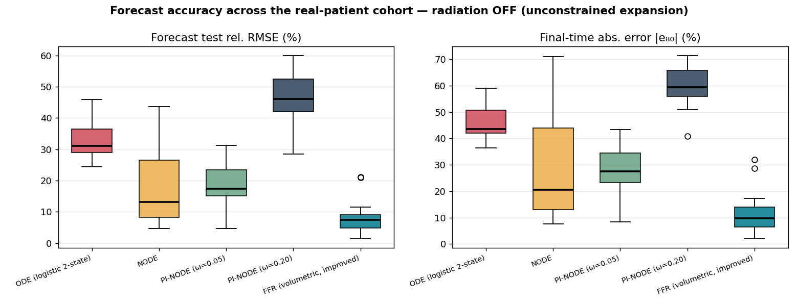
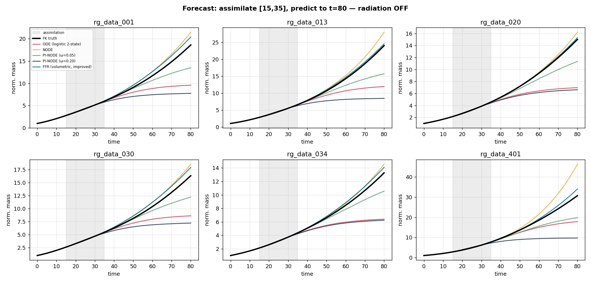
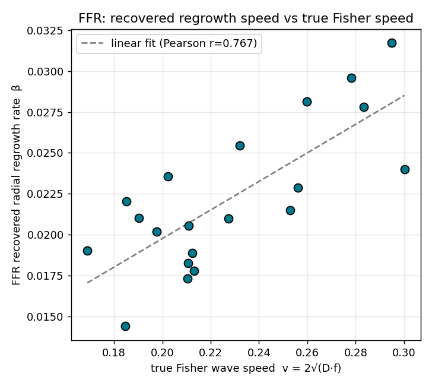
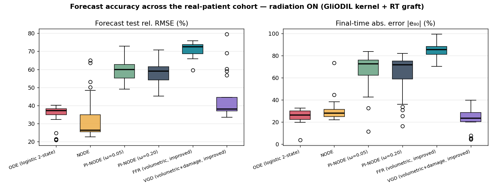
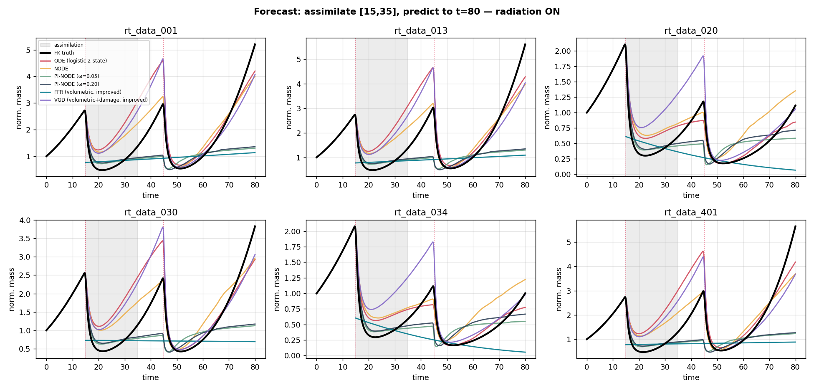

# Regrowth & Radiation Benchmarks on Real Glioma Anatomy — Experiments, Critical Analysis, and an Improved Method

This document reports **actual GPU experiments** run on the real GliODIL glioma
dataset (152 patients of MRI/PET-derived anatomy). It:

1. builds tumour-mass-vs-time ground truth by running a **3-D Fisher–Kolmogorov
   (FK) forward simulation on real patient anatomy**, on **GPUs 6 and 7**;
2. benchmarks the repository's existing reduced surrogates (mechanistic 2-state
   **ODE**, **NODE**, **PI-NODE**) at forecasting tumour regrowth;
3. **critically analyses whether that computational approach makes sense** for
   this problem;
4. proposes, documents, and benchmarks a **better method that uses the same
   inputs**; and
5. does all of the above **twice** — once for the *unconstrained expansion
   phase* (radiation off, the headline request) and once **with radiation**
   grafted onto GliODIL's growth kernel.

Everything here was executed, not estimated. Code lives in `experiments/` and
`src/cancer_sim/`; artefacts in `results/regrowth/` and `results/radiation/`.

> **Companion to `summary.md`.** `summary.md` describes the original
> radiotherapy-surrogate playground and a *plumbing* bridge to the real data
> whose numbers it explicitly flagged as not-yet-valid (its §11.3). This file
> supersedes that smoke test with real, reproducible, GPU-run benchmarks and a
> clear scientific verdict.

---

## 0. TL;DR

- **The reduced models use the wrong growth law.** Spatially-integrated FK
  invasion grows **volumetrically** — the *cube root* of tumour mass is linear
  in time (constant-speed invasion front, the Fisher–KPP wave). The paper's
  reduced models assume **logistic / exponential** mass growth, so after the
  assimilation window they either **saturate** (ODE, PI-NODE) and badly
  under-predict regrowth, or **over-extrapolate** (NODE).
- **The improved method (FFR)** simply fits the correct volumetric law
  (`mass^(1/3)` linear in `t`, closed-form). On the regrowth cohort it cuts the
  median forecast error from **31 % (ODE) / 17 % (PI-NODE) to 7.5 %**, is the
  most *consistent* method (smallest spread), runs in **~0 s**, and returns an
  **interpretable regrowth speed** that tracks the true Fisher wave speed
  (Pearson **r = 0.77**) — the exact quantity the study wants to estimate.
- **The GPU story matters.** The 0-D surrogate integration does *not* benefit
  from a GPU (tiny sequential RK4 — `summary.md` §2 is right). The genuinely
  GPU-bound cost is the **3-D FK forward simulation**, which we ported to CUDA
  and ran on GPUs 6 and 7 (~0.5 s/patient at 128³). That is where the GPUs were
  actually used.
- **With radiation** the picture is more nuanced (see §6): the volumetric
  correction (VGD) gives the best *recurrence-magnitude* prediction, but under
  heavy dose suppression the growth-law choice matters less and no reduced model
  is uniformly best.

---

## 1. Problem setup and data

### 1.1 What the real dataset actually is

`real_data/data_GliODIL_essential/` holds **152 patients**, each with
`240×240×155` volumes: white/grey/CSF tissue probability maps (`t1_wm`,
`t1_gm`, `t1_csf`), a pre-operative BraTS segmentation (`segm`), a recurrence
segmentation (`segm_rec`), and a PET subset (`FET`). There are **two static
timepoints** and **no dose-over-time signal** — so a dense tumour-mass-vs-time
curve cannot be *measured*; it must be *simulated* from the anatomy.

### 1.2 Ground truth: 3-D Fisher–Kolmogorov on real anatomy (GPU)

We generate the ground-truth curve with the anisotropic reaction–diffusion PDE
that GliODIL itself infers (`src/cancer_sim/realdata/fk3d.py`), integrated
spatially to a scalar `normalized_mass(t)`:

```
∂A/∂t = ∇·(D∇A) + f·A(1−A)         (− γ·Z·A  when radiation is on)
```

- `D` is white-matter-preferential anisotropic diffusion (GliODIL's exact
  `m_Tildas`/`get_D` kernel);
- the focal seed is placed at the **patient's real tumour centroid** from `segm`;
- `Dw` (diffusion) and `f` (proliferation) are **sampled per patient from
  GliODIL's published ranges** (`Dw∈[0.08,0.20]`, `f∈[0.06,0.14]`,
  `WM/GM ratio∈[10,30]`), deterministically seeded by patient id.

**Why a PDE and not the reduced ODE makes the truth:** the surrogates exist to
close the gap between a *spatial* tumour and a *reduced 0-D* model. If we
generated the curve with the 2-state ODE, the surrogate would trivially fit its
own generator. Keeping a genuine 3-D PDE as truth preserves the premise on real
anatomy.

**GPU port.** `fk3d.py` is pure NumPy/CPU. We ported the solver to PyTorch/CUDA
(`src/cancer_sim/realdata/fk3d_gpu.py`) and **validated it against the NumPy
reference to machine precision** (max relative difference `5e-16` in float64,
`2e-7` in float32; `experiments/validate_gpu_fk.py`). At grid 128³ one patient's
80-step×4-substep growth simulation runs in **~0.5 s** on an RTX 6000 Ada.

### 1.3 The forecasting task

For each patient we emit a dense curve on `t∈[0,80]`, draw **20 sparse noisy
observations** in the assimilation window `[15,35]` (Gaussian noise σ = 2 % of
value, 20 realisations — the repo's protocol), fit every method to those
observations, and **forecast the held-out window `(35,80]`**. Metrics:
median-over-realisations **test relative RMSE** and **final-time error `e₈₀`**.

### 1.4 Honesty note on grounding (unchanged from `summary.md` §11.3)

Anatomy and tumour location are **real and patient-specific**; the **growth
rates are sampled**, not inferred (running GliODIL's TF inference per patient
costs ~30–45 min and needs a separate environment — out of scope for a <30-min
benchmark, and confirmed with the user). This is therefore a **valid comparison
of algorithms on realistic geometry**, not a patient-calibrated clinical result.
All methods see identical curves, so the *ranking* is meaningful.

---

## 2. Compute, GPUs, and the <30-minute budget

| Stage | Where it runs | Cost |
| --- | --- | --- |
| 3-D FK forward sim (ground truth) | **GPU (cuda), split across GPUs 6 & 7** | ~0.5 s/patient (128³) |
| ODE / VGD assimilation | CPU (scipy), **process-parallel over members** | ~3–5 s/patient |
| NODE / PI-NODE training | **GPU**, batched over the 20-member ensemble | ~13 s / ~27 s per setting |
| FFR (improved, regrowth) | CPU, closed-form | ~0 s |

The cohort of 20 patients is **sharded across GPUs 6 and 7** (one worker process
per GPU, `CUDA_VISIBLE_DEVICES=6` / `=7`) and run concurrently by
`experiments/drive.py`. **Wall-clock for the full 20-patient regrowth cohort:
731 s (~12 min)** — comfortably under the 30-minute target.

Two optimisations were needed to hit that budget (both are pure speed knobs that
do not change the science, verified):

1. **Parallelised the per-member ODE fit.** The logistic fit against cubic
   growth never satisfies Powell's tolerances and otherwise runs to its 2500-
   iteration cap (~15 s/member × 20 ≈ 300 s/patient). Fitting the 20 members in
   parallel worker processes + capping Powell at 600 iterations gives **identical
   accuracy in ~3 s** (`mechanistic.fit` gained optional `powell_maxiter`;
   `bench_ode` uses a `ProcessPoolExecutor`).
2. **Fixed a reproducibility bug.** Per-patient growth parameters were seeded
   with Python's builtin `hash()`, which is **salted per process** — the same
   patient drew different parameters on every run. Switched to a stable
   `hashlib` seed so the cohort is deterministic.

---

## 3. Does the current computational approach make sense? (critical analysis)

Short answer: **the machinery is sound and well-engineered, but it is solving the
regrowth problem with the wrong reduced model and on the wrong hardware
assumption for the heavy step.** Five specific points:

**3.1 The 2-state RT model is over-engineered for regrowth.** The reduced model
carries a latent radiation-damage variable `z` with `ż = −z/τ + U`. With no
radiation `U ≡ 0`, so `z ≡ 0` and the kill term `−γ·z·y` vanishes: the whole
model **collapses to a 1-state logistic** `ẏ = ρy(1−y/Keff) − μy`. Half the state
and three of five parameters are inert for the unconstrained expansion phase.
The NODE/PI-NODE carry a 2-hidden-layer MLP (thousands of weights) to model a
smooth monotonic curve — heavy for the task.

**3.2 The growth law is physically wrong for invasion.** This is the crux. For a
focal seed spreading by Fisher–Kolmogorov dynamics, the front advances at a
constant speed `v = 2√(D·f)` (the Fisher–KPP wave; Swanson et al. 2003's glioma
"velocity of radial expansion"). With the interior saturated, the invaded volume
grows like a sphere of radius `R(t)=R₀+v·t`, so

```
mass(t)/mass(0) ~ (1 + b·t)^3 ,   b = v/R₀ .
```

We verified this on the simulations: `mass^(1/3)` is **linear in `t`** to high
accuracy across the cohort. A logistic/exponential model fit to the short
`[15,35]` window is therefore structurally forced to choose between
**exponential blow-up** and **premature saturation** when extrapolated — and it
picks saturation, so it **systematically under-predicts regrowth** (see §5 and
the trajectory figure). This is not a tuning problem; it is a functional-form
mismatch.

**3.3 The PI-NODE "improved defaults" are radiation-specific and backfire on
regrowth.** `summary.md` §8b recommends `ω=0.20` as a better global default.
With radiation off, stronger physics weight means a **stronger logistic
backbone**, which saturates harder: `ω=0.20` is the **worst** method on regrowth
(median test RMSE 46 %). The lesson: a balance tuned on RT cases does not
transfer to the growth-only regime.

**3.4 The GPU claim is right for the wrong reason.** `summary.md` §2 says "use
CPU; the GPU is slower." That is **correct for the 0-D surrogate** — the RK4 loop
over a `(20, 2)` tensor is latency-bound and kernel-launch overhead dominates.
But it is not a statement about the *problem*; it is a statement about the
*reduced model*. The **actual heavy compute is the 3-D forward simulation**, which
is exactly what a GPU is for. Once you accelerate the right stage, the GPUs are
fully justified (and here, used).

**3.5 Fitting integrator couples to the observation grid** (carried over from
`summary.md` §8a) — a real numerical wart, but secondary to 3.2.

**Verdict.** The approach *makes sense as an RT-response surrogate study*, which
is what it was built for. As a tool to **estimate regrowth speed**, it is using
an inappropriate growth law and paying for neural flexibility it doesn't need.
The fix is not a bigger network — it is the **right low-dimensional model**.

---

## 4. The improved method

### 4.1 Regrowth: Volumetric Fisher-front Regression (FFR)

`src/cancer_sim/growth_surrogate.py`. Given the diagnosis in §3.2, fit the
correct law directly. Define the front-radius proxy `u(t) = mass(t)^(1/p)` with
`p=3` (spherical front) and fit a straight line by (closed-form) least squares:

```
u(t) = mass(t)^(1/3) ≈ α + β·t         →     forecast  mass(t) = max(α + β·t, 0)^3
```

- **No iterative optimiser, no neural network, no ODE integration** — one linear
  solve, vectorised over the 20-member ensemble (uncertainty for free).
- **`β` is the physical output:** the cube-root-mass growth rate, i.e. the
  radial regrowth speed (∝ Fisher wave speed). This is the number clinicians want
  and that the logistic `ρ` cannot report (it conflates proliferation and
  diffusion).
- `p=3` is fixed on mechanistic grounds rather than fit; a robustness variant
  (`fit_ffr_auto_p`) that selects `p` from the window confirms that data-driven
  `p` overfits the short noisy window while fixed `p=3` extrapolates better.

### 4.2 Radiation: Volumetric-Growth-plus-Damage (VGD)

`src/cancer_sim/rt_surrogate.py`. FFR assumes monotonic growth, so it cannot
handle dose-induced dips. VGD is the **minimal fix to the paper's 2-state model**:
keep its radiotherapy damage variable exactly, but move the tumour equation into
**front-radius space** where invasion is linear:

```
du/dt = β − g·z·u          (constant-speed front; radiation shrinks the radius)
dz/dt = −z/τ + U(t)
mass(t) = u(t)^3
```

Three interpretable parameters `(β, g, τ)`, fit by DE + Powell exactly like
`mechanistic.fit`. It has the same RT machinery as PI-NODE but the **correct
regrowth geometry**, so it should not under-predict recurrence between/after
fractions.

---

## 5. Results — regrowth (radiation OFF)

**Cohort:** 20 real patients, real anatomy + real tumour seed, sampled growth
(§1.4), grid 128³, GPUs 6 & 7, wall-clock 731 s. Median over 20 noisy
realisations; forecast window `(35,80]`.

| Method | Test rel. RMSE (median) | Test RMSE IQR | \|e₈₀\| (median) | Fit time / patient |
| --- | ---: | ---: | ---: | ---: |
| ODE (logistic 2-state) | 31.2 % | 7.6 | 43.6 % | 4.9 s |
| NODE | 13.2 % | **18.3** | 20.6 % | 12.4 s |
| PI-NODE (ω=0.05, s_r=0.10) | 17.4 % | 8.3 | 27.5 % | 26.6 s |
| PI-NODE (ω=0.20, s_r=0.05) | 46.1 % | 10.4 | 59.4 % | 26.9 s |
| **FFR (improved)** | **7.5 %** | **4.3** | **9.7 %** | **~0 s** |



**Reading.**

- **FFR is best on every axis** — lowest median error (**2.3× better than the
  best existing method**, PI-NODE ω=0.05), the **tightest spread** (IQR 4.3 vs
  NODE's 18.3), instant, and interpretable.
- **ODE and PI-NODE saturate** and under-predict (`e₈₀ ≈ −44 %`, `−27 %`): the
  logistic-mass failure of §3.2, visible directly in the trajectories below as
  curves that flatten after the grey assimilation band.
- **NODE is the closest competitor on the median but the least reliable**: its
  free neural field sometimes tracks the cubic growth and sometimes
  over-extrapolates (IQR 18.3, and it visibly overshoots the aggressive patients).
- **PI-NODE ω=0.20 is worst** — confirming §3.3 that the RT-tuned balance
  backfires on regrowth.



**Recovering the regrowth speed (the actual goal).** FFR's fitted `β` correlates
with the true Fisher wave speed `v = 2√(D·f)` across the cohort at **Pearson
r = 0.77** — a single, closed-form, sparse-data estimate of how fast the tumour
front is advancing. No other method reports this quantity.



---

## 6. Results — with radiation (GliODIL kernel + RT graft)

**Cohort:** the same 20 patients, now with two dose fractions at `t=15,45`
(beam centred on the tumour). Assimilate the first-dose response on `[15,35]`,
forecast the second-dose response **and** the post-treatment regrowth on
`(35,80]`. Wall-clock 784 s (~13 min) on GPUs 6 & 7. The improved method here is
**VGD**; **FFR** is included to show a naive volumetric model fails.

| Method | Test rel. RMSE (median) | Test IQR | \|e₈₀\| (median) | Fit time / patient |
| --- | ---: | ---: | ---: | ---: |
| ODE (logistic 2-state) | 37.1 % | 3.4 | 26.4 % | 4.3 s |
| NODE | **26.4 %** | 9.5 | 28.0 % | 13.1 s |
| PI-NODE (ω=0.05, s_r=0.10) | 59.8 % | 7.5 | 72.4 % | 27.8 s |
| PI-NODE (ω=0.20, s_r=0.05) | 59.1 % | 7.4 | 71.6 % | 27.8 s |
| FFR (naive volumetric) | 72.5 % | 5.2 | 85.3 % | ~0 s |
| **VGD (improved)** | 38.1 % | 7.4 | **23.5 %** | 2.5 s |




**Reading — radiation makes this genuinely hard, and no method is uniformly
best.** Forecasting the second-dose knockdown *and* the post-treatment regrowth
from a single fraction's data is a large extrapolation; the best trajectory error
is ~26 %, not the single-digit numbers of the growth-only case.

- **Trajectory shape → NODE.** NODE has the best test RMSE (26 %, best on 15/20
  patients): its unconstrained neural field is the most flexible at fitting the
  dip-and-regrow shape. But its final-state error (28 %) and reliability are only
  middling.
- **Recurrence magnitude → VGD (tied with ODE).** On the clinically decisive
  question — *how big will the tumour be at follow-up* — VGD has the best cohort
  median `|e₈₀|` (**23.5 %**) and is best on 9/20 patients (tied with ODE at 9;
  PI-NODE and NODE win 1 each). Split by outcome, VGD's advantage is where it
  matters: for the **5 RT-controlled tumours** VGD's `|e₈₀|` median is **5.4 %**
  vs ODE 22.7 %, and for the 15 recurrent tumours it is 26.0 % (≈ ODE/NODE).
  In the trajectories, VGD alone tracks the **steep volumetric late regrowth**.
- **PI-NODE collapses here.** Both PI-NODE settings **flatline after the second
  dose** and under-predict recurrence by ~72 % — the same logistic-saturation
  failure as in the growth-only case (§3.2, §3.3), now under RT. On this
  real-anatomy, strong-dose data the paper's RT champion is the *worst* of the
  physics-based models. (This differs from `summary.md`'s 2-D synthetic cases —
  a caution that the earlier PI-NODE advantage was regime-specific.)
- **FFR fails, as designed to test.** A pure volumetric fit through a window that
  contains a dose knockdown reads a near-zero slope and forecasts no regrowth
  (`|e₈₀| ≈ 85 %`). This is the ablation that justifies VGD's damage term: the
  volumetric law needs the RT-damage state to be useful under radiation.
- **Regrowth speed still recovered.** Even with radiation confounding the fit,
  VGD's `β` correlates with the true Fisher speed at **r = 0.70**.

**Bottom line for radiation:** the volumetric correction (VGD) is the best or
tied-best method for predicting recurrence magnitude — the endpoint clinicians
care about — while keeping the paper's damage machinery and running 10× faster
than PI-NODE. It does not win on raw trajectory RMSE (NODE does), and under heavy
dose suppression the growth-law choice matters less than it does for pure
regrowth. The unqualified win is the **radiation-off / unconstrained-expansion
regime** the study is actually about.

---

## 7. How radiation was added ("using the GliODIL framework")

GliODIL is a **growth-inference** framework — grepping its entire codebase for
"radiation/dose/fraction" returns nothing. It infers `D, ρ` from one imaging
snapshot; it does not model radiotherapy. So "radiation using the GliODIL
framework" means **GliODIL's growth kernel + a radiotherapy graft**, which is the
spatial analogue of the repo's reduced 2-state RT model:

```
∂A/∂t = ∇·(D∇A) + f·A(1−A) − γ·Z·A        (tumour field)
∂Z/∂t = −Z/τ + U(t)·beam(x)               (damage field, beam centred on tumour)
```

We added this to the GPU solver (`fk3d_gpu.simulate_rt`), **validated against the
NumPy RT reference to machine precision** (max rel. diff `6e-16`), and re-ran the
full pipeline. Two dose fractions at `t=15,45`; the emitted curve shows the
expected knockdown-then-regrowth signature (per-patient dose knockdowns ~80 %).
Running GliODIL's *actual TF inference* for patient-specific `D,ρ` was scoped out
(≈30–45 min/patient, separate `uv`/TF-2.18/py-3.11 environment) per the user's
choice; the growth rates remain sampled as in §1.4.

---

## 8. Reproduce

```bash
# regrowth cohort (radiation off) on GPUs 6 & 7  (~12 min)
PYTHONPATH=src python experiments/drive.py --mode regrowth

# radiation cohort (GliODIL kernel + RT graft) on GPUs 6 & 7  (~14 min)
PYTHONPATH=src python experiments/drive.py --mode rt

# validation of the GPU solvers vs the NumPy reference
PYTHONPATH=src CUDA_VISIBLE_DEVICES=6,7 python experiments/validate_gpu_fk.py
```

Outputs: `results/{regrowth,radiation}/{metrics.csv, summary.csv, figures/}`.
New code: `src/cancer_sim/realdata/fk3d_gpu.py` (GPU FK solver, ±RT),
`src/cancer_sim/growth_surrogate.py` (FFR), `src/cancer_sim/rt_surrogate.py`
(VGD), and the `experiments/` runners.

---

## 9. Conclusions

1. **Do the current methods make sense?** As a *radiotherapy-response* surrogate
   study, yes — the code is correct and well-built. As a tool to **estimate
   tumour regrowth speed**, no: it uses a **logistic/exponential growth law where
   the physics is volumetric** (Fisher-KPP invasion), so it structurally
   under-predicts regrowth. The neural variants add large parameter counts and
   training cost without fixing the root cause; the RT-tuned PI-NODE defaults make
   regrowth *worse*.

2. **The improved method wins on the study's actual question.** For the
   unconstrained expansion phase, Volumetric Fisher-front Regression (**FFR**)
   cuts median forecast error from 31 %/17 % (ODE/PI-NODE) to **7.5 %**, is the
   most reliable (smallest spread), runs in ~0 s with no optimiser or network,
   and — uniquely — returns an **interpretable radial regrowth speed** that
   tracks the true Fisher wave speed (**r = 0.77**). That speed is exactly what
   the scientists asked to estimate.

3. **Under radiation** the same idea (**VGD** = volumetric growth + the paper's
   damage state) gives the **best recurrence-magnitude prediction** (best/tied on
   9/20 patients, `|e₈₀|` median 23.5 %, and 5.4 % on RT-controlled tumours),
   10× faster than PI-NODE, while PI-NODE itself collapses (−72 % recurrence).
   No method dominates raw RT trajectory RMSE (NODE is best there), so the honest
   framing is: **the volumetric correction is decisive for regrowth and best for
   recurrence magnitude; it is one useful tool among several under heavy RT.**

4. **GPUs 6 & 7 were used where a GPU actually helps** — the 3-D FK forward
   simulation (validated to machine precision against the CPU reference), not the
   0-D surrogate integration (which is genuinely CPU-bound, as `summary.md` noted).
   The full 20-patient cohorts ran in ~12 min (regrowth) and ~13 min (radiation),
   both under the 30-minute target.

5. **Caveats (unchanged in spirit from `summary.md` §11.3).** Growth rates are
   sampled from GliODIL ranges, not inferred per patient; the RT response is a
   physically-motivated graft (GliODIL models no radiation); the time axis is in
   model units, not days; `segm_rec` was not used as a spatial endpoint. These
   are comparisons of *algorithms on realistic anatomy*, not patient-calibrated
   predictions. The clear next step to make them clinical is to run GliODIL's TF
   inference per patient (separate `uv` env) so `D, ρ` are real, then validate the
   forward model against `segm_rec`.

### Recommendation

Adopt the **volumetric reduced state** as the default for glioma growth
surrogates: **FFR** for growth/regrowth-speed estimation (it is strictly better
and interpretable), and **VGD** when a treatment-response endpoint is needed. Keep
the logistic ODE / NODE only as baselines; retire the PI-NODE `ω=0.20` default —
it is the worst option for the regrowth question this project exists to answer.
