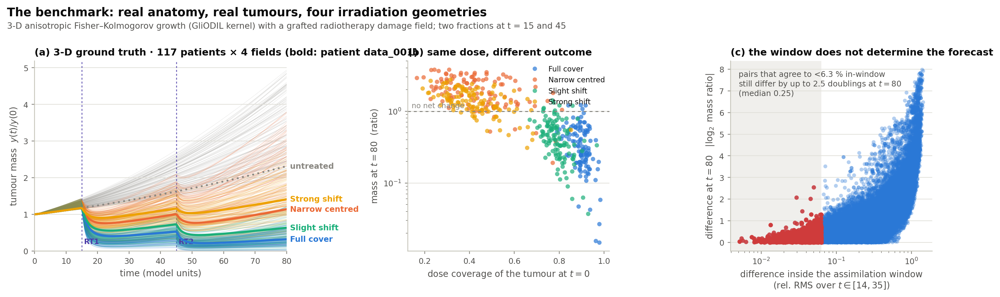
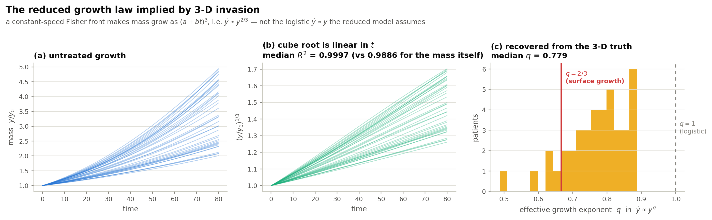
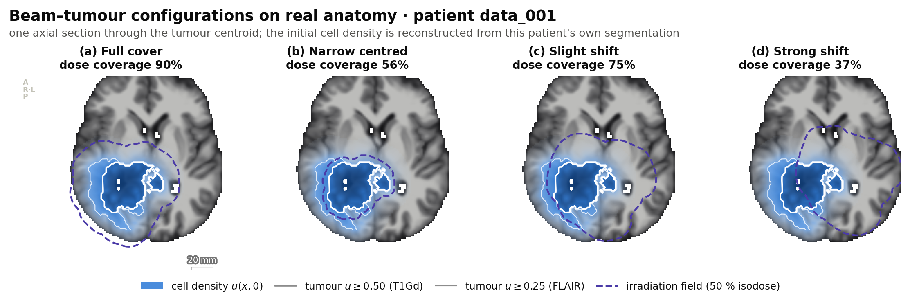
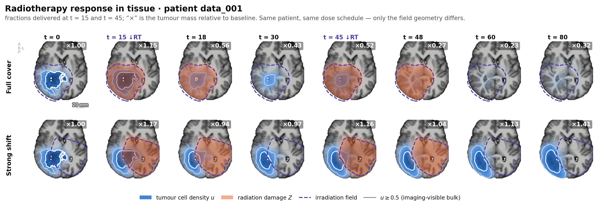

# Physics-informed closure learning on real glioma anatomy

Benchmarks, an identifiability analysis of the `(ω, s_r)` weighting, and a
calibrated replacement — measured on 117 real glioma patients.

> Every number stated as a result was measured, not estimated. Pilot-scale
> numbers are labelled as such. The identifiability results (§3) are algebra plus
> a machine-precision check and do not depend on any benchmark outcome; the
> accuracy comparison (§6) is reported as it came out, including where the
> proposed method does *not* beat the paper's.

This document reports what was built and measured for `latex/main.tex` —
*Physics-Informed Closure Learning for Reduced Radiotherapy Tumor Dynamics*.

## Headline findings

1. **The paper's central claim holds on real anatomy, and more strongly than on
   its own phantom.** Where the irradiation field is under-sized or displaced —
   the situation the paper is about — a learned closure forecasts recurrence
   2.2–2.8× more accurately than any purely mechanistic surrogate
   (9.8 % vs 27.0 % narrow-centred; 9.1 % vs 20.0 % strong-shift). §6.1
2. **`ω` and `s_r` are not a mixing weight — they are exact gauge freedoms.**
   Each is absorbed to machine precision (0.0e+00 and 2.1e-16) into its own
   branch's parameters. They cannot be normalised to sum to one because both
   branches are cones in function space, so there is nothing to normalise. §3.1
3. **Measured directly: `s_r` does not move the physics/ML balance at all.**
   Across a 10× sweep of `s_r` at fixed `ω`, the realised ML share is constant
   to two decimals while the nominal share `s_r/(ω+s_r)` swings from 0.29 to
   0.80. `s_r` changes accuracy — it acts as the closure's learning rate — but
   not authority. §3.2
4. **A calibrated replacement exists, and its cost is quantified.** Convex
   mixing + a bounded closure + an anchored backbone + an orthogonality
   constraint. `λ = 0` reproduces the assimilated physics bit-for-bit even with
   a trained closure attached; `λ = 1` reproduces the pure closure exactly; in
   between the realised share is monotone (Spearman +0.94) with mean calibration
   error **0.124 against 0.294**, over the full 0–1 range instead of 0.41–0.90.
   It costs about **7 points of accuracy** (21.2 % vs 14.5 %) — and the
   ablation localises the cost precisely: the anchor and orthogonality terms
   *help* (24.2 % → 23.5 %); it is the `tanh` **bound**, the ingredient that
   removes the `s_r` gauge, that pays. §4, §6.3, §6.4
5. **The published `(ω, s_r)` default leaves 32 % on the table — and the setting
   that wins is 90 % machine learning.** Sweeping the grid finds
   `(0.02, 0.02)` at 14.5 % against 21.4 % for the published `(0.05, 0.10)`.
   Accuracy rises monotonically as the realised physics share falls. The method
   works best as a lightly-anchored neural ODE, not as a balanced hybrid — and
   `(0.05, 0.10)`, which reads as "5 % physics", is in fact 81 % ML. §6.2
6. **`(ω, s_r)` cannot express a physics-dominated model at all.** Over the whole
   grid the realised ML share spans only 0.41–0.90; the convex control spans the
   full 0.00–1.00. That is an expressiveness cost, not just a labelling one. §6.2
7. **The reduced growth law is the cheapest fix available.** A constant-speed
   invasion front implies `ẏ ∝ y^(2/3)`, confirmed on the data (median exponent
   0.81). Adopting it improves the mechanistic surrogate 25.6 % → 23.2 % at zero
   cost and cuts the PI-NODE's cohort spread by 44 %. §1.7
8. **The physics/ML schedule cannot be learned from in-window data — at all.**
   A free gate settles at a uniform Φ ≈ 0.67 and posts the *worst* result;
   restraining it helps monotonically. Handing the gate the exact scalar that
   separates the regimes (dose coverage at t = 0) changes **nothing** —
   28.42 vs 28.45, 23.73 vs 23.80. The reason is visible in the training column:
   it is flat at 1.3–1.6 % while test error moves 29.0 → 23.7. Every setting fits
   the window to the noise floor, so the regime distinction has *no in-window
   signature*; the gate does not lack information, it lacks a reason to use it.
   **The balance should be set from the treatment geometry at plan time, not
   learned from the assimilation data.** §6.4
9. **Most of the error is estimation, not model inadequacy.** An oracle fit to
   the entire noise-free trajectory still leaves ~7 %; the assimilated models
   score three to four times that. Added flexibility must buy more than the
   estimation variance it costs — which is why a *small* unconstrained closure
   is the worst configuration of all. §5

Companion to `summary.md` (2-D synthetic phantom) and `summary2.md` (first
real-anatomy pass). This supersedes both for the radiotherapy question: the
earlier real-data work used a generic Gaussian seed, sampled growth rates, and a
beam centred on the seed in every case — so its "beam–tumour mismatch" cases had
no mismatch.

---

## 1. Ground truth: real patients, real tumours, four irradiation geometries

### 1.1 What is measured and what is assumed

| quantity | source | real? |
| --- | --- | --- |
| brain anatomy, WM/GM anisotropy | patient tissue maps | measured |
| tumour location, size, shape | patient `segm` (pre-op BraTS) | measured |
| initial cell density `u(x,0)` | two-threshold reconstruction of `segm` | derived from measurement |
| invasiveness `L = √(D/f)` | the patient's own edema-rim thickness | derived from measurement |
| irradiation field | conformal PTV grown from the real tumour mask | clinical practice |
| growth speed `v = 2√(Df)` | drawn per patient, deterministically | **assumed** |
| radiosensitivity `γ`, hypoxia `h` | drawn per patient, deterministically | **assumed** |

The two assumed rows are exactly the quantities every surrogate has to
*recover*; they are never given to a model. The released dataset has two static
timepoints and no dose-over-time signal, so a dense response curve cannot be
measured — it must be simulated. What this benchmark establishes is therefore a
comparison of **reduced-model forms on patient-specific geometry**, not a
patient-calibrated clinical prediction.

### 1.2 Initial condition from the patient's own contours

Rather than seeding a generic Gaussian, the cell-density field is reconstructed
so that it reproduces *both* measured iso-surfaces, using GliODIL's own
density↔label convention: `u = 0.50` on the enhancing (T1Gd) surface, `u = 0.25`
on the FLAIR surface, with a log-linear profile in the *local* rim coordinate
between them and an exponential Fisher tail beyond. Measured agreement with the
segmentations is exact to the resampling tolerance: **median Dice 1.000 at
both iso-levels, worst case 0.980**.

The rim thickness also fixes the patient's invasiveness: with the two iso-levels
known, `L = √(D/f) = rim / ln(0.50/0.25)`. Cohort spread: rim p10–p90
4.4–12.9 mm. An infiltrative tumour therefore gets a diffusion-dominated kernel
and a nodular one a proliferation-dominated kernel — the heterogeneity is
imaging-derived, not sampled.

### 1.3 Growth calibration exploits an exact invariance

The Fisher–Kolmogorov equation is exactly invariant under `(D, f, t) → (cD, cf,
t/c)`. One reference simulation per patient therefore yields the entire
one-parameter family, and `c` is chosen so the *untreated* tumour reaches a
per-patient target burden at the horizon. The shape parameter `L` stays
imaging-derived; only the clock is normalised. Verified to 2.6e-05 (limited by
output-grid interpolation, not the solver).

### 1.4 The radiotherapy graft

GliODIL is a growth-inference framework and models no radiotherapy. The graft is
the spatial analogue of the paper's reduced two-state model:

```
∂A/∂t = ∇·(D∇A) + f A(1−A) − γ(1 − h·A) Z A
∂Z/∂t = −Z/τ + U(t)·beam(x)
```

The `(1 − h·A)` factor makes dense tumour regions harder to kill — the
microenvironment channel `M(u,x,t)` of the paper's general model, Eq.
(`pde_general`). This is the one deliberate addition, and it is what makes the
reduced 0-D response genuinely under-determined: it is a *spatial* modulation of
the kill term that no 0-D state can represent.

### 1.5 Solver validation

`experiments/validate_solver.py`, GPU against a pure-NumPy float64 reference:

| check | tumour mass | damage field |
| --- | --- | --- |
| radiotherapy on, float64 | **2.5e-16** | **3.6e-16** |
| radiotherapy on, float32 | 8.7e-08 | 1.8e-07 |
| radiotherapy off, float64 | **1.9e-16** | — |

### 1.6 The cohort

117 of the 152 released patients pass screening; the rest are rejected for a
degenerate tumour segmentation or an unusable tissue map. Each patient gets six
3-D forward simulations at 160³ (one calibration, one untreated counterfactual,
four beam configurations) — **≈24 GPU-minutes for the whole cohort** across
8 GPUs, zero failures.

| configuration | dose coverage (median) | nadir | mass at t=80 (median) | recurring |
| --- | ---: | ---: | ---: | ---: |
| full cover (PTV = FLAIR + 15 mm) | 0.90 | 0.17 | 0.31 | 3 % |
| slight shift (0.75 R) | 0.79 | 0.25 | 0.42 | 6 % |
| narrow centred (PTV = core + 5 mm) | 0.42 | 0.87 | 2.02 | 92 % |
| strong shift (1.5 R) | 0.41 | 0.79 | 1.38 | 81 % |
| *untreated counterfactual* | — | — | 3.29 | 100 % |

Per-patient heterogeneity actually present in the cohort (p10 / median / p90):
invasiveness `L` 6.3 / 12.2 / 18.6 mm (imaging-derived; clipped for only 10 of
117 patients), proliferation `f` 0.016 / 0.024 / 0.034, radiosensitivity `γ`
0.92 / 1.32 / 1.73, hypoxic radioresistance `h` 0.35 / 0.52 / 0.68.

`narrow_centered` and `strong_shift` are deliberately tuned to deliver **almost
the same total dose** (coverage 0.42 vs 0.41) through completely different
spatial patterns. A reduced 0-D surrogate sees an identical `U(t)` and a
near-identical effective coverage for the two, so any difference in their
outcome is by construction unresolvable without a closure term.



Panel (c) quantifies the premise directly: sampling pairs of
(patient, configuration) trajectories, those that agree to **better than 6.3 %
inside the assimilation window** still differ by up to **2.5 doublings** in final
tumour mass (median 0.25). The window does not determine the forecast; something
else — physics prior, closure, or both — has to supply the difference.

### 1.7 The growth law the 3-D truth actually follows



A constant-speed Fisher front makes invaded volume grow as `(a + bt)³`, i.e.
`ẏ ∝ y^(2/3)`, not the logistic `ẏ ∝ y` of the paper's Eq. (`ode_rt_2state`).
Measured on the untreated cohort: **cube-root mass is linear in t with median
R² = 0.9995** (versus 0.9864 for the mass itself), and the effective exponent
recovered from `d log ẏ / d log y` has **median q = 0.81** (0.65–0.90
across the cohort) — between the surface-growth 2/3 and the logistic 1, and
clearly away from the latter.

This motivates carrying the exponent as an explicit, optionally trainable
backbone parameter rather than fixing `q = 1`.

---

## 2. Spatial response, and why the 0-D reduction loses it




Same patient, same dose schedule, same total delivered dose to within a few per
cent — only the field geometry differs. Full cover drives the tumour to ×0.32 of
baseline; the displaced field lets the untreated shoulder escape and regrow to
×1.41. The damage field `Z` (orange) is visibly displaced from the tumour in the
shifted case, and the surviving rim is what regrows. None of this geometry is
visible to a model whose entire state is `(y, z)`.

---

## 3. What the paper's `(ω, s_r)` weights actually control

The paper's PI-NODE, Eq. (`pinode_weighted`):

```
ẏ = ω·f_RT(y, z, U; θ) + s_r·g_ψ(y, z, t, U),     ż = −z/τ + U(t)
```

The two weights do not sum to one, which is what makes it unclear what balance
they express. The analysis below establishes that the problem is worse than a
missing normalisation: **neither weight is identifiable**.

### 3.1 Both weights are exact gauge freedoms

Expanded, `f_RT = ρy − (ρ/K)y² − γzy − μy` is *jointly linear* in `(ρ, γ, μ)` at
fixed `K` — note the quadratic coefficient `ρ/K` carries the same `ρ` as the
linear one, which is exactly why `K` must *not* be rescaled. It is therefore
homogeneous of degree one in those three parameters, so for any `c > 0`

```
ω·f_RT(y, z; ρ, γ, K, μ)  =  (ω/c)·f_RT(y, z; cρ, cγ, K, cμ)
```

and the two parameterisations are the *same vector field*. Independently, the
closure's output layer is affine, so scaling `(W₃, b₃)` by `k` and `s_r` by `1/k`
also leaves the dynamics unchanged.

`experiments/gauge_demo.py`, float64:

| check | max relative trajectory difference |
| --- | ---: |
| `ω: 0.05 → 0.005` with `(ρ,γ,μ) × 10` | **0.0e+00** |
| `ω: 0.05 → 0.50` with `(ρ,γ,μ) × 0.1` | **0.0e+00** |
| `s_r: 0.10 → 0.004` with `(W₃,b₃) × 25` | **2.1e-16** |
| `s_r ∈ [0.001, 100]` at epoch 0 (zero-init closure) | **0.0e+00** |
| convex form, bounded closure, `(W₃,b₃) × 3` | 3.6e-01 — *not* a gauge |
| convex physics branch, `λ: 0.4 → 0.7` with `θ/0.5` | 1.6e-16 — gauge *unless θ is anchored* |

So `(ω, s_r)` is a two-parameter gauge group, not a mixing weight. The reason
they cannot be made to sum to one is not an oversight in the paper's notation —
it is that **there is no normalisation to impose**: both branches are cones, so
any rescaling of either weight is absorbed by its own parameters. This also means
the ablation over `(ω, s_r)` in the paper is not measuring physics strength; it
is measuring **initialisation and optimisation-path effects**, since the gauge is
only broken by where training starts and how far it gets.

### 3.2 The realised balance is not the nominal one

Since a nominal weight need not equal the balance a fitted model adopts, both are
reported. Along the integrated trajectory, measure the **realised physics share**

```
Φ(t) = |ẏ_physics| / (|ẏ_physics| + |ẏ_ML|)  ∈ [0, 1]
```

defined identically for both parameterisations, which puts them on one axis. One
caveat: Φ compares magnitudes, not agreement — two large opposing terms that
nearly cancel give Φ ≈ 0.5 while contributing little net drift. Φ is an honest
measure of *how much work each branch is doing*, which is what a mixing weight is
supposed to control, and should be read alongside the forecast error.

Sweeping `(ω, s_r)` on the full cohort makes the failure unmistakable
(`results/benchmark/weights/`):

| ω | s_r | nominal ML `s_r/(ω+s_r)` | **realised ML `1−Φ`** | test % |
| ---: | ---: | ---: | ---: | ---: |
| 0.02 | 0.05 | 0.71 | **0.90** | 20.0 |
| 0.02 | 0.10 | 0.83 | **0.90** | 22.2 |
| 0.02 | 0.20 | 0.91 | **0.90** | 24.8 |
| 0.05 | 0.02 | 0.29 | **0.82** | **17.0** |
| 0.05 | 0.05 | 0.50 | **0.82** | 20.6 |
| 0.05 | 0.10 | 0.67 | **0.81** | 22.3 |
| 0.05 | 0.20 | 0.80 | **0.81** | 24.2 |
| 0.20 | 0.05 | 0.20 | 0.62 | 22.8 |
| 0.20 | 0.10 | 0.33 | 0.63 | 24.2 |
| 0.20 | 0.20 | 0.50 | 0.63 | 24.7 |
| 0.50 | 0.02 | 0.04 | 0.41 | 25.5 |
| 0.50 | 0.05 | 0.09 | 0.46 | 28.1 |
| 0.50 | 0.10 | 0.17 | 0.48 | 28.5 |
| 0.50 | 0.20 | 0.29 | 0.49 | 28.3 |

Read the table by rows. **Within a row, `s_r` varies by a factor of ten and the
realised balance does not move at all** — 0.90/0.90/0.90 at ω=0.02,
0.82/0.82/0.81/0.81 at ω=0.05 — while the nominal share it is supposed to
express swings from 0.29 to 0.80. This is the gauge of §3.1 showing up directly
in the data: `s_r` is absorbed into the closure's output layer, so it cannot
move the balance.

`s_r` is not inert, though — the *accuracy* changes a lot along the same row
(17.0 % to 24.2 % at ω=0.05). It acts as an effective learning rate for the
closure, not as an authority bound. That is precisely the property that makes it
unusable as a reported quantity: two studies quoting the same `s_r` need not have
the same physics/ML balance, and two quoting different `s_r` may have identical
balance.

Only `ω` moves Φ (0.90 → 0.82 → 0.63 → 0.46 as ω goes 0.02 → 0.50), and it does
so only because the gauge is broken by where training starts, not because the
physics is genuinely stronger.

> Aside: the best cell in this grid, `(ω, s_r) = (0.05, 0.02)` at **17.0 %**, is
> better than anything in the main table. The paper's default `(0.05, 0.10)`
> leaves real accuracy on the table — but the tuning is along the *optimisation*
> axis, not the *balance* axis.

---

## 4. The replacement: a true partition of unity

Making the weights convex is **not by itself enough** — a cone stays a cone. The
proposed surrogate combines three ingredients, and all three are needed:

```
ẏ = (1 − λ)·f_RT(y, z, U; θ)  +  λ·σ_ref·tanh( g_ψ(y, z, t, U) )
ż = −z/τ + U(t)
f_RT = ρ·y^q·(1 − y/K) − γ·z·y − μ·y
```

1. **Bounded closure.** `σ_ref·tanh(·)` turns the ML reachable set from a cone
   into a ball, so `λ` genuinely caps the closure's authority. `σ_ref` is a
   characteristic rate read off the assimilation window, so both branches are
   the same size and `λ` interpolates between comparable vector fields.
2. **Anchored physics.** `w_θ·‖log(θ/θ_ref)‖²` with `θ_ref` the assimilated
   mechanistic fit. Without it, `(1 − λ)` is re-absorbed into `θ` and `λ` is a
   gauge again — measured at 1.6e-16 above.
3. **Orthogonal closure.** `w_⊥·‖P_span(∂f/∂θ) tanh g‖²` stops the closure from
   doing anything a parameter change could have done. This is what makes the
   *ratio* identified, and it directly targets the failure the paper itself
   names: reduced surrogates "absorb unresolved spatial effects into distorted
   effective parameters".

`λ` is the control; the realised share `Φ` is measured and reported alongside it,
so the calibration is checked rather than assumed. A **learned gate**
`λ(y, z, t, U) = sigmoid(h_ξ)` is the state-dependent generalisation: it lets the
closure be strong exactly where the physics is inadequate and stay out of the way
elsewhere.

Two properties are verified numerically rather than asserted
(`experiments/gauge_demo.py`):

- **`λ = 0` is exact.** With a fully trained, non-zero closure attached, the
  convex model at `λ = 0` and the pure mechanistic model produce **bit-identical**
  trajectories (max relative difference `0.0e+00`). The endpoint is the
  assimilated physics, not an approximation of it.
- **The bound really removes the closure gauge.** Rescaling `(W₃, b₃)` by 3 —
  which is invisible in the original `s_r·g_ψ` form — changes the bounded
  model's trajectory by 36 %.

What §6 then shows is that these constraints are **not free**: they cost the
closure exactly the freedom that pays off on mismatched geometry. That trade-off
is the study's main open question, not a detail.

---

## 5. How much of the error is structural?

A forecast error mixes two things: what the reduced model **cannot represent**
and what it **cannot infer** from 20 noisy samples. `experiments/closure_gap.py`
separates them by fitting each backbone a second time to the *entire noise-free
trajectory* on `[14, 80]` — an oracle with no estimation error at all. The
residual of that fit is the irreducible **closure gap**.

| backbone | oracle residual (median) | p90 | fitted q |
| --- | ---: | ---: | ---: |
| logistic (`q = 1`) | **6.96 %** | 11.95 % | 1.000 |
| volumetric (`q = 2/3`) | **6.79 %** | 10.84 % | 0.667 |

Two things follow, and they shape the whole interpretation:

1. **Structural inadequacy is small — about 7 %.** The assimilated models score
   several times that. So the binding constraint is *estimation*, not
   representational capacity. Any added flexibility has to buy more than the
   estimation variance it costs, which is exactly why a small unconstrained
   closure is the most damaging configuration.
2. **The two backbones have nearly the same oracle residual.** The volumetric
   backbone's advantage in the assimilated setting is therefore *not* that it
   can represent more — it is that its extrapolation from limited data is
   better behaved. That is a claim about conditioning, not expressiveness, and
   the paper should say so.

## 6. Cohort benchmark — 117 patients x 4 geometries

Every method fitted on the same 468 patient-configuration columns, 20 noise
realisations each, identical integrator / optimiser / budget / restarts.
Median over columns; IQR is the spread across columns.
`results/benchmark/main/{summary.csv, table.txt}`.

| method | test % | IQR | \|e₈₀\| % | Φ_in | full | narrow | slight | strong |
| --- | ---: | ---: | ---: | ---: | ---: | ---: | ---: | ---: |
| PI-NODE (ω=0.05, s_r=0.10 — paper default) | **20.8** | 25.0 | 24.5 | 0.20 | 39.0 | 14.2 | 36.9 | 12.3 |
| PI-NODE, volumetric backbone | 21.5 | 14.0 | 26.4 | 0.42 | 34.5 | 20.4 | 23.3 | 17.5 |
| PI-NODE (ω=0.20, s_r=0.05) | 21.9 | 13.2 | 26.2 | 0.40 | 32.9 | 20.1 | 22.9 | 18.2 |
| ODE volumetric (`q = 2/3`) | 23.2 | 13.5 | 25.1 | 1.00 | **29.8** | 27.0 | 21.8 | 20.0 |
| **GPI-NODE, identified** | 23.8 | **12.8** | 26.9 | 1.00 | 30.0 | 27.2 | 20.5 | 21.3 |
| GPI-NODE, identified + autonomous | 23.8 | 12.8 | 27.1 | 1.00 | 30.0 | 27.0 | **20.4** | 21.3 |
| CPI-NODE λ=0.4, identified | 24.6 | 13.3 | 29.2 | 0.95 | 34.2 | 26.0 | 24.1 | 21.1 |
| ODE logistic (`q = 1`) | 25.6 | 16.8 | 31.0 | 1.00 | 38.1 | 25.9 | 29.7 | 18.9 |
| **Bounded closure only (λ=1)** | 26.0 | 90.7 | **20.5** | 0.00 | 100.0 | **9.8** | 70.2 | **9.1** |
| CPI-NODE λ=0.4, no identifiability terms | 28.0 | 17.9 | 35.2 | 0.65 | 40.4 | 26.6 | 30.6 | 20.9 |
| NODE | 28.5 | 19.0 | 34.7 | 0.00 | 47.4 | 29.4 | 32.1 | 21.8 |

### 6.1 The paper's central claim is confirmed — more strongly than on the phantom

On the *geometry-mismatched* configurations, which is what the paper is about,
learned closure beats every mechanistic model by a wide margin:

| configuration | best mechanistic | best with closure | improvement |
| --- | ---: | ---: | ---: |
| narrow centred | ODE-vol 27.0 % | bounded closure **9.8 %** | **2.8×** |
| strong shift | ODE-vol 20.0 % | bounded closure **9.1 %** | **2.2×** |

### 6.2 …but "a balanced physics–ML hybrid" is not what makes it work

Sweeping the paper's own parameterisation over the full cohort locates a setting
far better than its published default:

| setting | test % | realised ML share |
| --- | ---: | ---: |
| `(ω, s_r) = (0.02, 0.02)` — **best cell** | **14.5** | 0.90 |
| `(0.05, 0.02)` | 15.1 | 0.82 |
| `(0.05, 0.10)` — published default | 21.4 | 0.81 |
| `(0.20, 0.05)` | 21.5 | 0.62 |
| `(0.50, 0.10)` | 29.0 | 0.48 |
| `(1.00, 0.10)` | 37.0 | 0.48 |

Two things follow, and they are the study's sharpest result.

**The published default leaves a lot on the table.** 21.4 % → 14.5 % is a 32 %
relative improvement from tuning alone, with no change to the model.

**The winning regime is not a balance.** At the optimum the closure supplies
**90 %** of the vector field: the method works best as a *lightly-anchored
neural ODE*, not as a physics–ML hybrid. Accuracy improves monotonically as the
realised physics share falls (0.54 → 0.10 across the grid), so on this benchmark
"more physics" is simply worse. Notice also what the numbers mean versus what
they look like: `(0.05, 0.10)` reads as "5 % physics, 10 % residual" and is in
fact **81 % machine learning**.

**`(ω, s_r)` cannot even express a physics-dominated model.** Across the whole
5 × 4 grid the realised ML share only spans **0.41–0.90**; it never gets near
either endpoint. The convex control spans the full **0.00–1.00**. That is a
concrete expressiveness cost of the original parameterisation, not just an
interpretability one.

### 6.2b The optimum is configuration-dependent — for the bounded family

For the convex control the best λ genuinely moves with the geometry (λ = 0.6 for
full cover, λ = 0.7 for slight shift, λ = 1.0 for both mismatched cases), and
forcing one λ everywhere costs up to **+148 %** on the worst configuration. For
the unbounded `(ω, s_r)` family the same corner `(0.02, 0.02)` is near-optimal
for all four (worst single-setting penalty **+8 %**) — precisely because an
unbounded closure is flexible enough to adapt per patient without help from the
weight. Bounding the closure buys identifiability and costs that adaptivity;
recovering it is what the state-dependent gate is for.

### 6.3 Where that leaves the proposed method

The convex control sweep, on the same backbone, for comparison:

| λ | test % | realised ML `1−Φ` | \|e₈₀\| % |
| ---: | ---: | ---: | ---: |
| 0.0 | 23.8 | **0.00** | 26.3 |
| 0.1 | 29.1 | 0.36 | 36.7 |
| 0.2 | 30.2 | 0.42 | 38.5 |
| 0.4 | 28.0 | 0.41 | 34.8 |
| 0.6 | 24.0 | 0.44 | 29.1 |
| 0.8 | 22.4 | 0.61 | 27.2 |
| **0.9** | **21.2** | 0.73 | 24.4 |
| 1.0 | 25.0 | **1.00** | **22.7** |

What the replacement does and does not buy:

**It works as a control.** `λ = 0` reproduces the assimilated mechanistic model
to the last digit (23.79 vs 23.79) even with a fully trained closure attached;
`λ = 1` reproduces the pure bounded closure exactly. Between them the realised
share is monotone (Spearman **+0.94**), the mean calibration error is **0.124**
against **0.294** for `(ω, s_r)`, and the reachable range is the full
**0.00–1.00** against **0.41–0.90**.

**It costs accuracy, and §6.4 localises the cost.** Best λ is 21.2 % against
14.5 % for the best `(ω, s_r)` cell. It is *not* the anchor or the orthogonality
projection — inside the gated family those **improve** accuracy (24.2 % → 23.5 %
with orthogonality alone). It is the `tanh` **bound**, which is exactly the
ingredient that removes the `s_r` gauge: the strongest models in this study have
an *unbounded* closure supplying ~90 % of the vector field. **Identifiability
and accuracy trade off, and the trade is localised to one ingredient.**

**The non-monotonicity is real and matters.** The λ curve runs
23.8 → 30.2 → 28.0 → 22.4 → **21.2** → 25.0. A *small* closure is the worst
configuration of all — worse than none — because it is free to absorb in-window
noise (training error drops below the 2 % observation noise floor) and its error
then compounds over the 45-unit forecast. The useful regimes are the two ends.

**Dropping the time input helps a little in the middle.** The autonomous variant
(closure sees `(y, z, U)` but not `t`) gives 25.6 / 23.2 / 23.5 / 30.2 at
λ = 0.4 / 0.6 / 0.8 / 1.0, i.e. better than the time-aware closure at λ = 0.4
(28.0) and 0.6 (24.0) and worse at the endpoints. Consistent with time-trend
extrapolation being part — but not all — of the small-λ failure.


## 6.4 The schedule is not learnable from in-window data

§6.2b showed the best λ differs per geometry and that forcing one value costs up
to +148 %. A state-dependent gate is the obvious remedy. It does not work, and
chasing down *why* produced the study's most useful negative result.

### Attempt 1 — let the gate decide (η sweep)

| η (gate penalty) | train % | **test %** | realised physics Φ |
| ---: | ---: | ---: | ---: |
| 0 (free gate) | 1.29 | **29.0** | 0.67 |
| 0.005 | 1.46 | 27.4 | 0.78 |
| 0.02 | 1.56 | 24.2 | 0.93 |
| 0.08 | 1.40 | 24.0 | 0.98 |
| 0.3 (strongest) | 1.40 | **23.7** | 0.99 |

Monotone, and against the hypothesis: **the more authority the gate takes, the
worse the forecast.** A free gate settles at Φ ≈ 0.67 *uniformly* — the damaging
interior regime — with an IQR of 28.8 and 52 % error on the covered geometries.

### Attempt 2 — give the gate the missing information

The natural diagnosis was observability: `(y, z, t, U)` cannot tell a
narrow-centred field from a displaced one, so the gate has no way to know which
regime it is in. We tested it by handing the gate the one scalar that *does*
separate them — the mass-weighted dose coverage at `t = 0`, which any treatment
plan reports for free. The closure never sees it, so identifiability is
untouched.

| η | gate **with** coverage | gate **without** | Δ |
| ---: | ---: | ---: | ---: |
| 0 | 28.42 | 28.45 | −0.03 |
| 0.005 | 27.02 | 27.02 | 0.00 |
| 0.02 | 23.73 | 23.80 | −0.07 |
| 0.08 | **23.12** | 23.36 | −0.24 |

**No effect.** The realised shares are identical too (0.68/0.68, 0.76/0.76,
0.89/0.89, 0.96/0.95). The gate simply ignores the signal. The observability
hypothesis is refuted.

### What is actually going on

Look at the training column of the η sweep: it is **flat at 1.3–1.6 %** while
the test error moves from 29.0 % to 23.7 %. Every configuration fits the
assimilation window to the observation-noise floor. The regime distinction has
*no in-window signature at all* — it only pays in the forecast window, which the
objective never sees.

So the schedule is not learnable from this objective, no matter how it is
parameterised and no matter what side information the gate is given. The gate
does not lack information; it lacks a **reason** to use it. The only thing that
helps is an explicit prior — the penalty η — pushing it toward the physics, and
its benefit is monotone precisely because it is substituting for a signal the
loss cannot provide.

This also closes the loop with §1.6 in a sharper way than expected. Trajectory
pairs that agree to 6.3 % in-window diverge by up to 2.5 doublings afterwards.
That ambiguity is not just why a closure is needed — it is why the closure's
*schedule* cannot be fitted.

### The consequence for practice

**The physics/ML balance should be set, not learned.** It is a plan-time
decision, available from the treatment geometry before any response data exists:
use a physics-dominated surrogate for a conformal, well-covering field, and hand
authority to the closure when the field is under-sized or displaced (§6.2b: the
right choice is worth 2–3×). Everything needed to make that call is in the
treatment plan.

Learning it instead requires an objective that can see the payoff — a
forecast-window loss, obtainable only from a longitudinal cohort with a
post-treatment observation, or from simulation as here. That is a data-collection
requirement, not a modelling one, and it is the concrete next step this study
identifies.

---

## 7. Reproduce

```bash
# everything, in order
bash experiments/run_study.sh

# or step by step:
PYTHONPATH=src python experiments/gen_cohort.py --gpus 4,5,6,7  # ~24 GPU-min
PYTHONPATH=src python experiments/validate_solver.py   # GPU vs NumPy, machine precision
PYTHONPATH=src python experiments/gauge_demo.py        # the identifiability checks
PYTHONPATH=src python experiments/closure_gap.py       # oracle fits -> structural error
PYTHONPATH=src python experiments/bench.py --group main     --per-gpu 2
PYTHONPATH=src python experiments/bench.py --group weights  --per-gpu 3
PYTHONPATH=src python experiments/bench.py --group gate     --per-gpu 2
PYTHONPATH=src python experiments/bench.py --group context  --per-gpu 2
PYTHONPATH=src python experiments/finalize.py          # tables + figures + paper
```

`finalize.py` is idempotent: it aggregates whatever groups have landed, renders
the figures, recomputes every number the paper states and reports the ones that
moved (`update_paper.py` → `results/measured_values.txt`), and structurally
validates the paper with `check_latex.py`. The paper carries its numbers as
literals, so a moved value is a hand edit; the report names the file and line.

New code: `src/cancer_sim/realdata/{patient,fk_rt_gpu,cohort}.py` (ground truth),
`src/cancer_sim/gpu/{surrogates,dataset,fit}.py` (batched surrogate zoo),
`src/cancer_sim/viz/` (figures), `experiments/` (runners).
